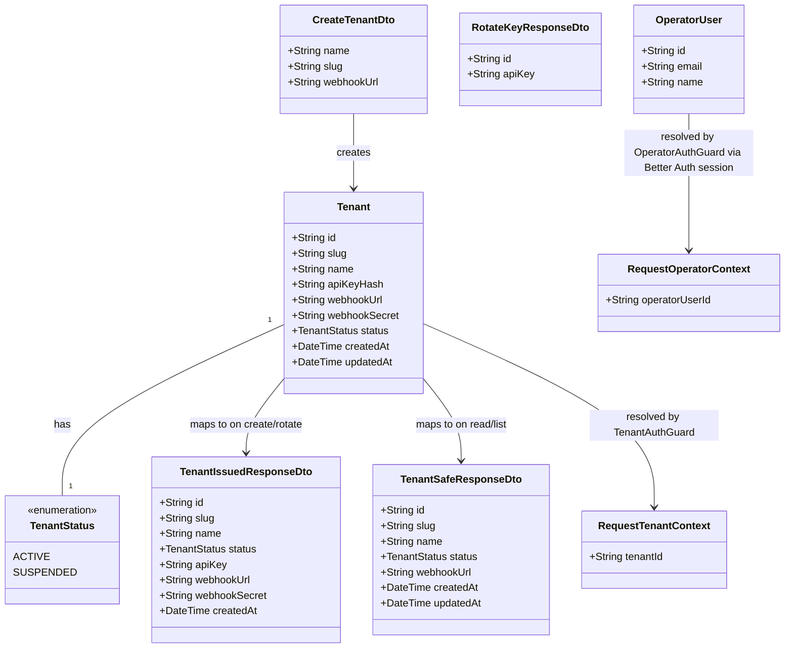

# Tenant Onboarding & Isolation

## Requirements

Establish tenant identity as the foundational access boundary of Crossfade: let
an operator register and lifecycle-manage source-application tenants (create,
suspend, reactivate, rotate credential), and let every tenant authenticate
itself via a single opaque credential that resolves to exactly one tenant and
scopes all its data access — so no tenant can ever see, list, or infer another
tenant's existence or data, and every later Crossfade feature (handoff requests,
advisor management, sessions) inherits a safe-by-default isolation boundary.

## Entities

`OperatorUser` and its backing session/credential records (`Session`, `Account`,
`Verification`) are owned and schema-managed by Better Auth's own Prisma
adapter, not hand-modeled by this feature — see Operations for the exact model
set Better Auth generates into `schema.prisma`.

## Approach

1. Persistence & Domain Module:
   - Introduce the first ORM/persistence layer in `apps/api`: Prisma against
     PostgreSQL, with a `Tenant` model as the sole table this feature owns.
   - Introduce the first domain module, `TenantsModule`, following Nest's
     Controller → Service → Repository(Prisma) layering — this becomes the
     reference pattern every later domain module (002+) copies.
   - Split the module into two access surfaces from day one: an operator surface
     (`/operator/tenants/*`, privileged, separately guarded) and a tenant-facing
     surface (`/tenants/me`, credential-guarded) — never share a guard between
     them.

2. Technical Implementation:
   - Tenant authentication: opaque bearer API key (`cf_live_<random>`), SHA-256
     hashed at rest, resolved by a `TenantAuthGuard` that runs before any
     handler and attaches `tenantId` to the request context. No JWT, no session,
     no per-request tenant identity in body/params (FR-006). Unchanged by this
     update — the tenant is a source application authenticating
     machine-to-machine, not a person logging in, so Better Auth (a
     human-session auth library) does not apply here.
   - Operator authentication: session-based login via Better Auth, since
     `apps/web` now hosts a real operator login screen (not a hypothetical
     future UI). Better Auth owns its own
     `User`/`Session`/`Account`/`Verification` tables (via its Prisma adapter,
     against the same Postgres database `PrismaService` already connects to) and
     issues an `httpOnly` session cookie on successful email/password sign-in.
     `OperatorAuthGuard` no longer compares a shared secret — it resolves the
     incoming request's session cookie via Better Auth's own
     session-verification API and attaches `{ operatorUserId }` as
     `RequestOperatorContext`. This replaces the v1-era single-shared-secret
     mechanism now that a real login surface exists to authenticate against,
     without touching the `Tenant` schema or `TenantAuthGuard` at all.
   - Isolation enforcement: application-layer scoping. Every tenant-facing query
     is written against a `PrismaService` wrapped by convention: all
     reads/writes take `tenantId` from `RequestTenantContext`, never from a
     route param or body field. Cross-tenant reference attempts always resolve
     as `404 Not Found`, never `403`, so existence is never confirmable
     (FR-008).
   - Global exception handling: a single `GlobalExceptionFilter` (`@Catch()`)
     maps all thrown domain exceptions and Prisma errors to a uniform
     `ErrorResponse` shape and HTTP status, so no handler needs its own
     try/catch for expected failure modes.

3. Business Logic:
   - Registration is atomic and race-safe: slug uniqueness is enforced by a DB
     unique constraint (not a check-then-insert), and the Prisma
     unique-violation error (`P2002`) is caught and translated to `409 Conflict`
     — closes the concurrent-duplicate-registration edge case.
   - Webhook URL is validated for well-formed HTTPS synchronously at
     registration (hard reject if malformed/missing); reachability is not
     checked (registration must not depend on the tenant's own deploy timing).
   - Suspend/reactivate are idempotent state transitions (repeat calls are a
     no-op `200`, not an error) — status is the single source of truth for
     authorization at the `TenantAuthGuard` layer; suspended tenants are
     rejected with `403` after successful credential resolution (distinguishable
     from `401` for the client, per contract).
   - Credential rotation replaces `apiKeyHash` in place on the existing `Tenant`
     row; the raw key is returned once in the rotation response body and never
     persisted or logged in plaintext anywhere (constraint carried into
     Safeguards).
   - Credential "expiry" (mentioned in spec's User Story 2 wording) is
     explicitly out of scope for v1 — no expiry field exists on `Tenant`; only
     missing/invalid/suspended states are enforced. This is a resolved
     ambiguity, not a gap: v1 credentials are valid until rotated or the tenant
     is suspended.

## Structure

### Inheritance Relationships

1. `TenantAuthGuard` implements Nest's `CanActivate` interface.
2. `OperatorAuthGuard` implements Nest's `CanActivate` interface.
3. `GlobalExceptionFilter` implements Nest's `ExceptionFilter` interface,
   decorated `@Catch()`.
4. `DuplicateTenantSlugException`, `InvalidWebhookUrlException`,
   `TenantSuspendedException`, `InvalidCredentialException` all extend a shared
   `BusinessException extends HttpException` base class.
5. `CreateTenantDto` uses `class-validator` decorators (no custom base class
   needed — existing Nest `ValidationPipe` convention).
6. `AuthController` (new) forwards its catch-all route to Better Auth's own
   request handler — it implements no domain interface, it is a thin adapter
   between Nest's routing and Better Auth's framework-agnostic handler.

### Dependencies

1. `OperatorTenantsController` depends on `OperatorTenantsService`; guarded by
   `OperatorAuthGuard`.
2. `TenantsController` (tenant-facing, `/tenants/me`) depends on
   `TenantsService`; guarded by `TenantAuthGuard`.
3. `OperatorTenantsService` and `TenantsService` both depend on `PrismaService`
   (new, shared) for persistence — no direct Prisma client usage in controllers.
4. `TenantAuthGuard` depends on `PrismaService` directly (guards run before
   DI-scoped services are convenient to inject business logic into; guard stays
   thin — hash lookup only, no business rules).
5. `TenantCredentialService` (new, shared utility) is depended on by
   `OperatorTenantsService` (key generation/hashing on create/rotate) and
   `TenantAuthGuard` (hash comparison on resolution) — single place that owns
   the hashing algorithm.
6. `GlobalExceptionFilter` is registered globally in `main.ts` via
   `app.useGlobalFilters(...)`; depended on by nothing, consumed implicitly by
   every controller.
7. `OperatorAuthGuard` depends on the shared `BetterAuthService` (new — a thin
   wrapper around the configured Better Auth server instance) to resolve the
   incoming request's session cookie to an `operatorUserId`; it no longer
   depends on `process.env.OPERATOR_API_KEY` or any string-comparison logic.
8. `BetterAuthService` depends on the same `PrismaService`/underlying Postgres
   connection as every other module in this feature — Better Auth's Prisma
   adapter reads/writes its own `User`/`Session`/`Account`/`Verification` tables
   through it, so there remains exactly one database connection pool for the
   whole app, not a second one.
9. `AuthController` depends on `BetterAuthService` to obtain the configured
   handler it forwards requests to; it has no dependency on
   `OperatorTenantsService` or `Tenant` at all — Better Auth's own routes
   (`/api/auth/*`) know nothing about tenants.

### Layered Architecture

1. Controller Layer: `OperatorTenantsController` (privileged CRUD/lifecycle),
   `TenantsController` (tenant self-read, `GET /tenants/me`) — parse/validate
   input via DTOs + `ValidationPipe`, delegate to services, never touch Prisma
   directly.
2. Service Layer: `OperatorTenantsService`
   (create/suspend/reactivate/rotate/get), `TenantsService` (self-lookup by
   resolved `tenantId`) — own all business rules (uniqueness, status
   transitions, isolation scoping).
3. Guard Layer: `TenantAuthGuard` (credential → `tenantId` resolution, status
   check), `OperatorAuthGuard` (Better Auth session → `operatorUserId`
   resolution) — run before controller handlers, attach
   `RequestTenantContext`/`RequestOperatorContext` respectively.
4. Repository/Data Access Layer: `PrismaService` (Prisma client wrapper,
   `Tenant` model access) — single source of DB access for this module; Better
   Auth's own Prisma adapter reads/writes its
   `User`/`Session`/`Account`/`Verification` tables through the same underlying
   connection.
5. Exception Handling Layer: `GlobalExceptionFilter` — unified translation of
   `BusinessException` subclasses and Prisma errors (e.g. `P2002`) into the
   `ErrorResponse` DTO shape and correct HTTP status.
6. Auth Integration Layer (new): `BetterAuthService` (configured Better Auth
   server instance, session verification) + `AuthController` (mounts Better
   Auth's own routes under Nest's routing) — sits alongside, not inside, the
   Guard Layer; `OperatorAuthGuard` is the layer's only consumer within this
   feature.

## Operations

### Create/Update Persistence Schema - `Tenant` (Prisma)

1. Responsibility: Define the `Tenant` model and `TenantStatus` enum as the
   first persisted table in `apps/api`.
2. Attributes:
   - `id`: `String @id @default(uuid())` — internal identifier, never guessable.
   - `slug`: `String @unique` — immutable after creation.
   - `name`: `String`.
   - `apiKeyHash`: `String` — SHA-256 hex digest of the active raw key.
   - `webhookUrl`: `String`.
   - `webhookSecret`: `String`.
   - `status`: `TenantStatus @default(ACTIVE)`.
   - `createdAt`: `DateTime @default(now())`.
   - `updatedAt`: `DateTime @updatedAt`.
3. Constraints: `slug` unique index (DB-level, closes
   concurrent-duplicate-registration race). No cascade/delete path defined in v1
   (no deletion feature).
4. Migration: add `apps/api/prisma/schema.prisma`, run initial Prisma migration;
   add `PrismaService`/`PrismaModule` (global, injectable) as shared infra
   alongside this feature.
5. Better Auth models (new — additive to the same `schema.prisma`): generate
   Better Auth's standard `User`, `Session`, `Account`, `Verification` models
   via its own schema-generation step (`@better-auth/cli generate`, targeting
   the Prisma adapter), rather than hand-authoring them — these tables are owned
   by Better Auth, this feature only declares the adapter configuration that
   points Better Auth at `PrismaService`'s connection. `Tenant` and Better
   Auth's models coexist in one schema/migration history; there is no foreign
   key from `Tenant` to `User` in v1 (operators are not scoped per tenant —
   there is exactly one operator identity space).

### Configure Auth - `BetterAuthService`

1. Responsibility: Own the single configured Better Auth server instance for the
   app — the one place `betterAuth(...)` is constructed, so no other file
   re-configures or re-instantiates it.
2. Attributes: holds the Better Auth instance, configured with the Prisma
   adapter (pointed at `PrismaService`'s client, PostgreSQL provider) and the
   email/password sign-in method enabled (the simplest login mechanism
   sufficient for v1's single operator — no social/OAuth providers, no
   magic-link email delivery infrastructure needed yet).
3. Methods:
   - `getSession(headers: Headers): Promise<{ operatorUserId: string } | null>`
     - Logic: delegate to Better Auth's own session-verification API, passing
       the incoming request's headers (which carry the session cookie); on a
       valid session, return `{ operatorUserId: session.user.id }`; on
       no/invalid session, return `null` — no exception thrown here, the caller
       (`OperatorAuthGuard`) decides how to react.
4. Constraints: `BETTER_AUTH_SECRET` is a required environment variable (Better
   Auth uses it to sign session tokens) — the app MUST fail fast at boot if it
   is unset, same discipline as any other required secret in this codebase.

### Create Controller - `AuthController`

1. Responsibility: Mount Better Auth's own request handler onto Nest's HTTP
   server, so `/api/auth/*` (sign-in, sign-out, session refresh, etc.) is served
   by Better Auth itself rather than reimplemented.
2. Routes:
   - Catch-all under `/api/auth/*` → forwarded verbatim to `BetterAuthService`'s
     underlying handler; Better Auth owns the exact sub-route shapes (e.g.
     `/api/auth/sign-in/email`), not this feature.
3. Annotations: a Nest catch-all route decorator (e.g.
   `@All('api/auth/*splat')`) forwarding the raw request/response objects to
   Better Auth's handler — no `ValidationPipe`, no `GlobalExceptionFilter`
   involvement, since Better Auth manages its own request lifecycle and error
   shapes for these routes.
4. Constraints: this controller is unguarded (no
   `TenantAuthGuard`/`OperatorAuthGuard`) — it is the entry point _to_
   authentication, not a protected resource; `OperatorAuthGuard` is what
   protects everything downstream of a successful sign-in.

### Create Utility - `TenantCredentialService`

1. Responsibility: Single owner of credential/secret generation and hashing so
   no other file re-implements crypto logic.
2. Methods:
   - `generateApiKey(): { raw: string; hash: string }`
     - Logic:
       - Generate 32 bytes of cryptographically secure randomness
         (`crypto.randomBytes`).
       - Format raw key as `cf_live_<base64url-encoded-bytes>`.
       - Compute SHA-256 hex digest of the raw key as `hash`.
       - Return both; caller persists only `hash`, returns `raw` to the operator
         exactly once.
   - `hashApiKey(raw: string): string`
     - Logic: SHA-256 hex digest of the input, used by `TenantAuthGuard` to look
       up by hash.
   - `generateWebhookSecret(): string`
     - Logic: Generate 32 bytes of secure randomness, return as a hex/base64url
       string; stored as `webhookSecret` on create only (no rotation path in
       v1).
3. Constraints: Never log the raw key or secret at any log level, in this
   service or any caller — enforced by code review, called out explicitly in
   Safeguards.

### Implement Service - `OperatorTenantsService`

1. Interface Definition: `createTenant`, `suspendTenant`, `reactivateTenant`,
   `rotateKey`, `getTenant`.
2. Core Methods:
   - `createTenant(dto: CreateTenantDto): Promise<TenantIssuedResponseDto>`
     - Input Validation: `dto` already validated by `ValidationPipe`
       (name/slug/webhookUrl required, `webhookUrl` must be well-formed HTTPS —
       custom `class-validator` decorator or
       `@IsUrl({ protocols: ['https'], require_protocol: true })`).
     - Business Logic: generate `apiKey`/`webhookSecret` via
       `TenantCredentialService`; attempt `prisma.tenant.create(...)` with
       `status: ACTIVE`; on Prisma unique-constraint violation (`P2002` on
       `slug`), throw `DuplicateTenantSlugException`.
     - Exception Handling: malformed/missing `webhookUrl` → `ValidationPipe`
       throws `400` before reaching the service (FR-002); duplicate slug →
       `DuplicateTenantSlugException` → `409` via `GlobalExceptionFilter`
       (FR-003).
     - Return Value: `TenantIssuedResponseDto` including the raw `apiKey` and
       `webhookSecret` (only time either is ever returned in plaintext).
   - `suspendTenant(tenantId: string): Promise<TenantSafeResponseDto>`
     - Business Logic:
       `prisma.tenant.update({ where: { id: tenantId }, data: { status: SUSPENDED } })`;
       idempotent — if already `SUSPENDED`, still returns `200` with unchanged
       record (no error).
     - Exception Handling: unknown `tenantId` → `404 Not Found`.
     - Return Value: `TenantSafeResponseDto` (no secrets).
   - `reactivateTenant(tenantId: string): Promise<TenantSafeResponseDto>`
     - Business Logic: mirrors `suspendTenant`, sets `status: ACTIVE`,
       idempotent.
     - Return Value: `TenantSafeResponseDto`.
   - `rotateKey(tenantId: string): Promise<RotateKeyResponseDto>`
     - Business Logic: generate new `apiKey` via `TenantCredentialService`;
       update `apiKeyHash` in place on the existing row; old key immediately
       stops resolving (no multi-key window in v1, per FR-012/Assumptions).
     - Return Value: `RotateKeyResponseDto` with the new raw `apiKey` (shown
       once).
   - `getTenant(tenantId: string): Promise<TenantSafeResponseDto>`
     - Business Logic: fetch by `id`; used by operator to confirm historical
       data survived suspension (FR-010).
     - Exception Handling: unknown `tenantId` → `404 Not Found`.
3. Dependency Injection: `PrismaService`, `TenantCredentialService`.
4. Transaction Management: `createTenant` is a single-statement Prisma call
   relying on the DB unique constraint for atomicity — no explicit transaction
   block needed since there is exactly one write.

### Implement Service - `TenantsService`

1. Interface Definition: `getSelf`.
2. Core Methods:
   - `getSelf(tenantId: string): Promise<TenantSafeResponseDto>`
     - Input Validation: `tenantId` comes only from `RequestTenantContext`
       (attached by `TenantAuthGuard`), never from a route param — this handler
       takes no tenant-identifying input from the caller (FR-006).
     - Business Logic: fetch tenant by `id`; this is the canonical "confirm my
       own identity resolved correctly" endpoint (User Story 2's independent
       test).
     - Return Value: `TenantSafeResponseDto`.
3. Dependency Injection: `PrismaService`.

### Create Guard - `TenantAuthGuard`

1. Responsibility: Resolve every tenant-facing request to exactly one `tenantId`
   from the `Authorization: Bearer <key>` header, or reject before any handler
   runs (FR-004, FR-005, FR-008 entry point).
2. Methods:
   - `canActivate(context: ExecutionContext): Promise<boolean>`
     - Logic:
       - Extract `Authorization` header; if missing or not `Bearer <token>`
         shape → throw `InvalidCredentialException` (→ `401`).
       - Hash the token via `TenantCredentialService.hashApiKey`; look up
         `Tenant` by `apiKeyHash`.
       - No match → throw `InvalidCredentialException` (→ `401`) — no tenant
         identity resolved, matches contract's "invalid key doesn't confirm
         whether any tenant uses it."
       - Match but `status === SUSPENDED` → throw `TenantSuspendedException` (→
         `403`) — authenticated but rejected, distinguishable per contract from
         `401`.
       - Match and `status === ACTIVE` → attach `{ tenantId: tenant.id }` to
         `request` (as `RequestTenantContext`), return `true`.
3. Annotations: applied via `@UseGuards(TenantAuthGuard)` on `TenantsController`
   (and every future tenant-facing controller in 002+).
4. Constraints: Never accepts `tenantId` from body/query/param as an override or
   fallback (FR-006) — the only input is the header.

### Create Guard - `OperatorAuthGuard`

1. Responsibility: Gate the `/operator/tenants/*` surface with a real,
   per-operator authenticated session (via Better Auth), distinct from any
   tenant's API key and distinct from a single shared secret — so no tenant API
   key can reach operator endpoints, and operator access is now tied to an
   individual login, not a value anyone with the env var could use.
2. Methods:
   - `canActivate(context: ExecutionContext): Promise<boolean>`
     - Logic: call `BetterAuthService.getSession(request.headers)`; `null`
       (missing/invalid/expired session cookie) → throw
       `InvalidCredentialException` (→ `401`); a resolved session → attach
       `{ operatorUserId }` to `request` (as `RequestOperatorContext`), return
       `true`.
3. Annotations: applied via `@UseGuards(OperatorAuthGuard)` on
   `OperatorTenantsController`.
4. Constraints: never accepts an `X-Operator-Key` header or any static shared
   secret as a fallback — the only valid input is a Better Auth session cookie.
   `OPERATOR_API_KEY` is retired entirely by this update; `BETTER_AUTH_SECRET`
   (see `BetterAuthService`) replaces it as the required environment variable
   the app fails fast on if unset.

### Add Operator Login Page - `apps/web`

1. Responsibility: Give the operator an actual screen to authenticate against,
   since `OperatorAuthGuard` now depends on a real Better Auth session existing
   — without this, the guard would have no way to ever be satisfied.
2. Scope: a minimal email/password sign-in page in `apps/web`, using Better
   Auth's client SDK (`createAuthClient`, pointed at `apps/api`'s `/api/auth`
   base path) to submit credentials and establish the session cookie; on
   success, the operator is routed into whatever operator-facing views this
   feature or a later one exposes.
3. Constraints: this is the one deliberate, explicitly-scoped touch of
   `apps/web` this feature makes (superseding the prior "MUST NOT modify
   `apps/web`" constraint — see Safeguards) — limited to the login page and
   Better Auth client wiring; no broader operator dashboard/UI is in scope here
   beyond what's needed to authenticate. Visual design/UX treatment is an
   implementation detail, not specified further by this canvas.

### Create Controller - `OperatorTenantsController`

1. Responsibility: Expose the privileged tenant-lifecycle API (FR-001, FR-009,
   FR-011, FR-012).
2. Routes:
   - `POST /operator/tenants` — body: `CreateTenantDto` → `201`
     `TenantIssuedResponseDto` | `400` | `409`.
   - `POST /operator/tenants/:id/suspend` → `200` `TenantSafeResponseDto` |
     `404`.
   - `POST /operator/tenants/:id/reactivate` → `200` `TenantSafeResponseDto` |
     `404`.
   - `POST /operator/tenants/:id/rotate-key` → `200` `RotateKeyResponseDto` |
     `404`.
   - `GET /operator/tenants/:id` → `200` `TenantSafeResponseDto` | `404`.
3. Annotations: `@Controller('operator/tenants')`,
   `@UseGuards(OperatorAuthGuard)` at class level, `@Body()`/`@Param('id')` per
   route, `ValidationPipe` applied globally or per-route for `CreateTenantDto`.
4. Constraints: never returns `apiKeyHash` or `webhookSecret` on any route
   except the plaintext-once fields on create/rotate responses.

### Create Controller - `TenantsController`

1. Responsibility: Expose the tenant self-identity endpoint (User Story 2's
   independent test surface, and the pattern 002+ controllers copy).
2. Routes:
   - `GET /tenants/me` → `200` `TenantSafeResponseDto` | `401` | `403`.
3. Annotations: `@Controller('tenants')`, `@UseGuards(TenantAuthGuard)` at class
   level; reads `tenantId` from `request` (attached by guard), never from a
   param.

### Create Exception Handler - `GlobalExceptionFilter`

1. Responsibility: Unified translation of all thrown exceptions (domain
   `BusinessException` subclasses, Prisma errors, Nest's built-in
   `HttpException`s) into one `ErrorResponse` shape.
2. Exception Types:
   - `InvalidCredentialException` → `401`, message
     `"Invalid or missing API credential"`.
   - `TenantSuspendedException` → `403`, message `"Tenant is suspended"`.
   - `DuplicateTenantSlugException` → `409`, message
     `"Tenant slug already registered"`.
   - `TenantNotFoundException` → `404`, message `"Tenant not found"`.
   - Prisma `PrismaClientKnownRequestError` (`P2002`) not already caught by a
     service → mapped defensively to `409`.
   - Anything uncaught → `500`, generic message only (no stack trace, no
     internal detail in the response body).
3. Methods:
   - `catch(exception: unknown, host: ArgumentsHost): void`
     - Logic: inspect exception type/instance, map to `{ statusCode, message }`,
       write via `response.status(...).json(...)`. Log full exception
       server-side (never the raw request body, which may contain nothing
       sensitive here, but guard the pattern for future features that may carry
       credentials in-body).
4. Annotations: `@Catch()`, registered globally via
   `app.useGlobalFilters(new GlobalExceptionFilter())` in `main.ts`.
5. Response Format: `{ statusCode: number; message: string }` — matches the
   shape already specified in `contracts/tenant-authentication.md`.

### Create Business Exceptions

1. Inheritance: `BusinessException extends HttpException`;
   `InvalidCredentialException`, `TenantSuspendedException`,
   `DuplicateTenantSlugException`, `TenantNotFoundException` all
   `extends BusinessException`.
2. Attributes: each subclass fixes its own HTTP status and message at
   construction (no dynamic `errorCode` needed — v1 has no client-facing
   error-code taxonomy beyond HTTP status + message, per the two existing
   contracts).
3. Constructors: each subclass takes an optional message override, defaults to
   the contract-specified message.
4. Usage Scenarios: thrown from guards (`TenantAuthGuard`, `OperatorAuthGuard`)
   and services (`OperatorTenantsService`, `TenantsService`) at the exact points
   described in their Operations entries above.

## Norms

1. Annotation Standards: controllers use `@Controller(path)` + class-level
   `@UseGuards(...)`; DTOs use `class-validator` decorators (`@IsString()`,
   `@IsUrl(...)`, `@IsNotEmpty()`); providers use standard `@Injectable()`; no
   custom decorators introduced beyond what's listed above.
2. Dependency Injection: constructor injection only, one responsibility per
   injected service; guards inject `PrismaService`/`TenantCredentialService`
   directly (no intermediate service layer inside guards, to keep them fast and
   side-effect-free besides the DB lookup).
3. Exception Handling:
   - All business-rule failures throw a `BusinessException` subclass — never
     return an error via a normal return value or a raw `throw new Error(...)`.
   - `BusinessException` subclasses fix HTTP status at the exception, not at the
     filter, so the filter stays a pure dispatcher.
   - Unified error response format: `{ statusCode: number; message: string }`
     for every 4xx/5xx from this module.
   - `GlobalExceptionFilter` logs full exception detail server-side; response
     bodies never include stack traces or raw DB errors.
4. Data Validation: all controller inputs validated via Nest's `ValidationPipe`
   (`whitelist: true, forbidNonWhitelisted: true`) against DTOs; no manual
   `if (!x) throw` validation in controllers or services for shape/format checks
   — only for business-rule checks (uniqueness, status).
5. Logging: never log `apiKey`, `webhookSecret`, or their raw values at any log
   level, in any service, guard, or exception filter — only `tenantId`/`slug`
   may appear in logs. This is the single hard rule the plan.md constraint
   (`plaintext credential never logged`) resolves to in code. Extended by this
   update: never log an operator's password or raw session-cookie value either —
   Better Auth's own request handling is trusted to manage this internally, but
   any custom logging added around `OperatorAuthGuard`/`BetterAuthService` must
   follow the same discipline.
6. Documentation Standards: no doc comments required beyond what's already
   specified in `contracts/operator-api.md` and
   `contracts/tenant-authentication.md`, which remain the source of truth for
   request/response shapes — this Operations section must not drift from them.
7. Auth Configuration: `BetterAuthService` is the single place `betterAuth(...)`
   is constructed — no controller, guard, or service outside it may import
   Better Auth's server-side configuration APIs directly; `OperatorAuthGuard`
   only ever calls `BetterAuthService.getSession(...)`.

## Safeguards

1. Functional Constraints: every tenant-facing route MUST be behind
   `TenantAuthGuard`; every operator route MUST be behind `OperatorAuthGuard`;
   no route may accept a `tenantId` as a path/query/body parameter that
   overrides the guard-resolved value (FR-006).
2. Performance Constraints: `TenantAuthGuard`'s per-request lookup MUST be a
   single indexed query (`apiKeyHash` should be indexed, in addition to `slug`);
   no N+1 or additional round-trips in the auth path.
3. Security Constraints: raw `apiKey`/`webhookSecret` MUST be returned in
   plaintext only in the exact create/rotate response bodies specified in
   `contracts/operator-api.md`, and MUST NOT be persisted, logged, or returned
   by any other route (including `GET /operator/tenants/:id`); `apiKeyHash` MUST
   use SHA-256 (or stronger) over the full-entropy random token, never a fast
   general hash misapplied to a weak input. Operator session cookies (issued by
   Better Auth) MUST be `httpOnly` and `secure` in any non-local environment —
   never readable by client-side JavaScript, never transmitted over plain HTTP.
4. Integration Constraints: this feature's touch on `apps/web` is limited
   strictly to the operator login page and Better Auth client wiring (see
   Operations) — it MUST NOT introduce any endpoint or behavior related to
   self-serve tenant signup, billing/plan tiers, or multi-advisor assignment
   (FR-013, explicit non-goals), and MUST NOT build out any operator
   dashboard/UI beyond the login screen itself.
5. Business Rule Constraints: `slug` uniqueness MUST be enforced at the database
   level (unique index), not only in application code, to close the
   concurrent-registration race; suspend/reactivate MUST be idempotent (repeat
   calls return `200`, never an error).
6. Exception Handling Constraints:
   - Every `BusinessException` subclass MUST map to exactly one HTTP status and
     a fixed, non-internal message.
   - Exception messages MUST NOT expose whether a given `slug` or `tenantId`
     belongs to another tenant when the requester is not that tenant —
     cross-tenant reference attempts always return `404`, never `403` or a
     message implying existence (FR-008).
   - All business exceptions MUST be caught and formatted by
     `GlobalExceptionFilter` — no controller/service may format its own error
     response.
7. Technical Constraints: this feature is the first to introduce
   Prisma/PostgreSQL into `apps/api` — schema changes MUST go through Prisma
   migrations (no manual DB changes); `PrismaService` MUST be the only Prisma
   client instance in the app (shared, injectable, not re-instantiated per
   module); Better Auth's Prisma adapter MUST be configured against that same
   connection, never a second pool. `BETTER_AUTH_SECRET` MUST be a required
   environment variable with a fail-fast boot check, replacing the retired
   `OPERATOR_API_KEY` variable entirely.
8. Data Constraints: `slug` MUST be validated as URL-safe (lowercase
   alphanumeric + hyphen) and immutable after creation; `webhookUrl` MUST be
   validated as a well-formed HTTPS URL at registration (hard reject on
   malformed, no reachability check required to pass).
9. API Constraints: response shapes MUST exactly match
   `contracts/operator-api.md` and `contracts/tenant-authentication.md` (status
   codes, field names, once-only secret fields) — these two contract files are
   binding, not illustrative, for this implementation.
