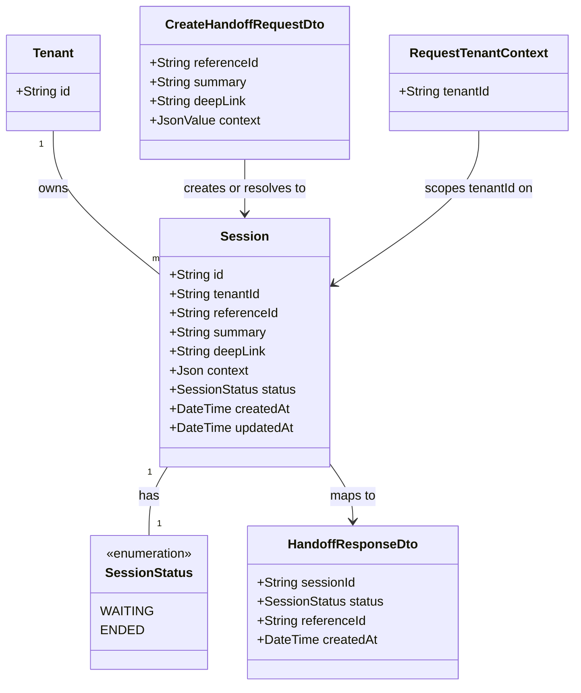

# Handoff Intake

## Requirements

Give an already-authenticated tenant a single entry point to hand a user off to
a live advisor: accept a reference to the interaction plus tenant-owned context,
create a `waiting` session ready for an advisor to pick up, resolve repeat
submissions for the same interaction to that same session instead of duplicating
it, and pass the tenant's structured context through untouched — so every
downstream Crossfade feature (chat, routing, outcomes) has exactly one
trustworthy entry record per interaction to build on.

## Entities

## Approach

1. Module & Reuse Strategy:
   - Add a second domain module, `HandoffsModule`, next to feature 001's
     `TenantsModule` in `apps/api/src` — same Controller → Service → Prisma
     layering 001 established, no new architectural pattern introduced.
   - Reuse feature 001's infrastructure unmodified: `TenantAuthGuard`
     (credential → `tenantId` resolution), `PrismaService` (shared Prisma
     client), `GlobalExceptionFilter`/`BusinessException` base, and the
     `ErrorResponse` shape (`{ statusCode, message }`). This feature adds zero
     new authentication or exception-handling infrastructure.
   - **Hard prerequisite**: this Operations section assumes feature 001's
     `Tenant` model, `PrismaService`, `TenantAuthGuard`,
     `TenantCredentialService`, `BusinessException`, and `GlobalExceptionFilter`
     already exist in `apps/api/src`/`apps/api/prisma/schema.prisma`. If they
     are not yet present, feature 001's own REASONS-Canvas Operations
     (`docs/spdd/prompt/202608181415-[Feat]-001-api-tenant-onboarding-isolation.md`)
     MUST be executed first (or in the same generation pass) — this feature does
     not re-specify or duplicate any of that infrastructure.

2. Technical Implementation:
   - Single new endpoint, `POST /handoffs`, guarded by the existing
     `TenantAuthGuard` (`@UseGuards(TenantAuthGuard)`), reading `tenantId` only
     from the guard-attached `RequestTenantContext` — never from the request
     body.
   - Concurrency safety for "at most one non-ended session per (tenantId,
     referenceId)": a Prisma partial unique index at the database layer, not an
     application-level check-then-insert. The service attempts
     `prisma.session.create(...)`; on a Prisma unique-constraint violation
     (`P2002` on the partial index), it re-queries for the existing non-ended
     session and returns that instead — atomic regardless of request timing or
     horizontal scaling.
   - Structured context: stored as a Prisma `Json` column (`jsonb`), validated
     only for "is this syntactically valid JSON if present" — no shape/schema
     validation, no interpretation, ever. This satisfies FR-002's opacity
     requirement while still being genuine structured storage.
   - No new `GlobalExceptionHandler`/`GlobalExceptionFilter` is introduced — the
     one from feature 001 is reused as-is; this feature contributes no new
     exception types beyond what `ValidationPipe` and the existing
     `BusinessException` hierarchy already cover.

3. Business Logic:
   - `referenceId` and `summary` are the only required fields; `deepLink` and
     `context` are optional and MUST NOT be rejected for their shape or content
     (only `deepLink`'s well-formedness as a URL and `context`'s syntactic JSON
     validity are checked, never their meaning).
   - A repeat handoff request for a `referenceId` that already has a non-ended
     `Session` MUST return that session's identifier via `200 OK`, not create a
     new row; a repeat request for a `referenceId` whose only prior session has
     `status: ENDED` MUST create a fresh `Session` via `201 Created`.
   - No field for advisor selection/routing exists on the DTO at all — not
     accepted, not ignored-with-meaning; anything not in the DTO shape is simply
     not part of the request contract (`ValidationPipe` with `whitelist: true`
     strips unknown fields silently, consistent with the contract's "unknown
     fields ignored" note).
   - Validation and error handling: missing `referenceId`/`summary` → `400` via
     `ValidationPipe` (no service-layer check needed); malformed `deepLink` →
     `400` via DTO-level URL validation; malformed (non-parseable) `context` →
     `400` via DTO-level JSON validation; all other paths succeed with
     `200`/`201` as described above.

## Structure

### Inheritance Relationships

1. `HandoffsController` and `HandoffsService` introduce no new inheritance —
   plain Nest `@Controller()`/`@Injectable()` classes, consistent with 001's
   `TenantsController`/`TenantsService` pattern.
2. No new `BusinessException` subclass is introduced by this feature — the
   uniqueness-conflict path is normal control flow (catch Prisma's `P2002`,
   re-query, return `200`), not an exception surfaced to the client.
3. `CreateHandoffRequestDto` uses `class-validator` decorators only (no custom
   base class), matching feature 001's `CreateTenantDto` convention.

### Dependencies

1. `HandoffsController` depends on `HandoffsService`; guarded by
   `TenantAuthGuard` (imported from `TenantsModule`, not reimplemented).
2. `HandoffsService` depends on `PrismaService` (shared, from
   `TenantsModule`/`PrismaModule`) for all `Session` reads/writes — no direct
   Prisma client instantiation.
3. `HandoffsModule` imports `TenantsModule` (for `TenantAuthGuard`) and the
   shared `PrismaModule` — no new shared infrastructure module is created by
   this feature.
4. `GlobalExceptionFilter` (registered globally in `main.ts` by feature 001)
   implicitly covers this module's controllers — `HandoffsModule` registers
   nothing exception-related itself.

### Layered Architecture

1. Controller Layer: `HandoffsController` — parses/validates the handoff payload
   via `CreateHandoffRequestDto` + `ValidationPipe`, delegates to
   `HandoffsService`, maps the service's `{ session, created }` result to `201`
   or `200` with `HandoffResponseDto`.
2. Service Layer: `HandoffsService` — owns the create-or-resolve business rule:
   attempt insert, catch uniqueness conflict, re-query, decide `created` vs.
   `existing`.
3. Repository/Data Access Layer: `PrismaService` (reused from 001) — `Session`
   model reads/writes live here; no new data-access abstraction introduced.
4. Exception Handling Layer: `GlobalExceptionFilter` (reused from 001) —
   `ValidationPipe`'s `400`s and any unexpected errors flow through it
   unchanged; this feature adds no new exception types to its catalogue.

## Operations

### Create/Update Persistence Schema - `Session` (Prisma)

1. Responsibility: Add the `Session` model and `SessionStatus` enum to
   `apps/api/prisma/schema.prisma`, extending 001's schema (not replacing it).
2. Attributes:
   - `id`: `String @id @default(uuid())`.
   - `tenantId`: `String` — foreign key to `Tenant.id` (`@relation`), resolved
     only from `RequestTenantContext`, never from the request body.
   - `referenceId`: `String` — tenant's own reference ID, required.
   - `summary`: `String` — required.
   - `deepLink`: `String?` — optional, nullable.
   - `context`: `Json?` — optional, nullable, `jsonb` in Postgres, stored
     opaquely.
   - `status`: `SessionStatus @default(WAITING)`.
   - `createdAt`: `DateTime @default(now())`.
   - `updatedAt`: `DateTime @updatedAt`.
3. Enum: `SessionStatus { WAITING ENDED }` — this feature only ever writes
   `WAITING` and only ever reads `ENDED` as the terminal exclusion for
   uniqueness; further values (`ASSIGNED`, `ACTIVE`, etc.) are added by features
   003/004 via their own migrations, not anticipated here.
4. Constraints: partial unique index — `@@unique([tenantId, referenceId])` is
   insufficient alone (it would block reuse after a session ends); implement via
   a raw SQL migration adding
   `CREATE UNIQUE INDEX session_tenant_reference_open_idx ON "Session" ("tenantId", "referenceId") WHERE status != 'ENDED'`
   (Prisma doesn't yet support partial indexes natively in the schema DSL — add
   via `prisma/migrations/<timestamp>_add_session/migration.sql` alongside the
   generated migration, or a `@@index` plus this raw addition).
5. Migration: run Prisma migration to add this table to the same
   database/instance as 001's `Tenant` table — no new datastore.

### Implement Service - `HandoffsService`

1. Interface Definition:
   `createOrGetSession(tenantId: string, dto: CreateHandoffRequestDto): Promise<{ session: Session; created: boolean }>`.
2. Core Methods:
   - `createOrGetSession(tenantId, dto)`
     - Input Validation: `dto` already validated by `ValidationPipe`
       (`referenceId`/`summary` required and non-empty; `deepLink` if present
       must be a well-formed URL via `@IsUrl()`; `context` if present must be a
       syntactically valid JSON value — accepted as-is since Nest's body parser
       already parses JSON, so any parsed `context` value reaching the DTO is by
       definition valid JSON; no additional shape check).
     - Business Logic:
       - Attempt
         `prisma.session.create({ data: { tenantId, referenceId: dto.referenceId, summary: dto.summary, deepLink: dto.deepLink ?? null, context: dto.context ?? null, status: 'WAITING' } })`.
       - On success: return `{ session, created: true }`.
       - On a Prisma `PrismaClientKnownRequestError` with code `P2002` (unique
         violation on the partial index): re-query
         `prisma.session.findFirst({ where: { tenantId, referenceId: dto.referenceId, status: { not: 'ENDED' } } })`
         and return `{ session: found, created: false }`. This re-query MUST NOT
         throw if the row is momentarily not found (a rare race between the
         failed insert and the winning insert's commit) — retry the read once;
         if still not found, propagate as a `500` (should not happen under
         correct index semantics, but must not silently return `undefined`).
       - Any other Prisma error propagates unhandled to `GlobalExceptionFilter`
         (mapped to `500`, per 001's established pattern).
     - Exception Handling: no custom exception thrown by this method for the
       "already exists" case — that is a successful, expected outcome
       (`created: false`), not an error.
     - Return Value: `{ session, created }` — controller uses `created` to pick
       `201` vs `200`.
3. Dependency Injection: `PrismaService`.
4. Transaction Management: no explicit transaction needed — the
   insert-then-conditionally-reread pattern relies on the DB unique constraint
   for atomicity of the write itself; the re-read on conflict is a separate,
   idempotent read with no write side effects.

### Create Controller - `HandoffsController`

1. Responsibility: Expose `POST /handoffs`, the sole entry point for this
   feature (FR-001–FR-007).
2. Routes:
   - `POST /handoffs` — body: `CreateHandoffRequestDto` → on `HandoffsService`
     returning `created: true`, respond `201` with `HandoffResponseDto`; on
     `created: false`, respond `200` with the same `HandoffResponseDto` shape
     (mapped from the existing session) → `400` on DTO validation failure →
     `401`/`403` per `TenantAuthGuard` (reused from 001, unmodified).
3. Annotations: `@Controller('handoffs')`, `@UseGuards(TenantAuthGuard)` at
   class level, `@Body()` with `ValidationPipe` applied (global or route-level,
   consistent with 001's convention).
4. Constraints: reads `tenantId` exclusively from the guard-attached
   `RequestTenantContext` on `request` — the DTO has no `tenantId` field, and
   none is ever accepted even if sent.

### Create DTO - `CreateHandoffRequestDto`

1. Responsibility: Validate the inbound handoff payload's required shape without
   touching `context`'s internal structure.
2. Attributes:
   - `referenceId`: `string` — `@IsString() @IsNotEmpty()`.
   - `summary`: `string` — `@IsString() @IsNotEmpty()`.
   - `deepLink`: `string?` — `@IsOptional() @IsUrl({ require_protocol: true })`.
   - `context`:
     `Record<string, unknown> | unknown[] | string | number | boolean | null`
     (optional) — `@IsOptional()` only; no `@ValidateNested()`, no shape
     decorator, no schema class — deliberately unvalidated beyond "parsed
     successfully as JSON by Nest's body parser," per FR-002.
3. Annotations: standard `class-validator` decorators only;
   `@ApiProperty()`-style OpenAPI decorators are optional and not required for
   correctness.
4. Constraints: `ValidationPipe` at the app or controller level MUST use
   `whitelist: true` so any unrecognized field (e.g. a tenant-sent `advisorId`)
   is silently stripped, never rejected and never read (FR-005).

### Create DTO - `HandoffResponseDto`

1. Responsibility: Uniform response shape for both the `201` and `200` cases,
   matching `contracts/handoff-intake-api.md` exactly.
2. Attributes:
   - `sessionId`: `string` — `session.id`.
   - `status`: `'WAITING'` (mapped to lowercase `"waiting"` in the JSON response
     body to match the contract's example, or the contract is treated as
     case-illustrative — implementer follows the exact casing shown in
     `contracts/handoff-intake-api.md`: `"waiting"`).
   - `referenceId`: `string` — `session.referenceId`.
   - `createdAt`: `ISO 8601 string` — `session.createdAt`, reflecting the
     _original_ session's creation time even on the `200`/`created: false` path
     (never the current request's time).
3. Constraints: identical shape on both `201` and `200` responses — only the
   HTTP status code and `createdAt`'s value differ between "just created" and
   "already existed."

## Norms

1. Annotation Standards: controller uses `@Controller('handoffs')` + class-level
   `@UseGuards(TenantAuthGuard)`; DTO uses `class-validator` decorators only;
   service uses standard `@Injectable()` — no new decorator patterns introduced
   beyond feature 001's established set.
2. Dependency Injection: constructor injection only; `HandoffsService` injects
   `PrismaService` directly, mirroring 001's `TenantsService` pattern — no new
   shared service layer introduced for a single-method service.
3. Exception Handling:
   - No new `BusinessException` subclass is created by this feature; the
     "session already exists" outcome is modeled as a return value
     (`created: false`), never thrown.
   - Any error this feature does propagate (validation failures, unexpected DB
     errors) reuses 001's `ErrorResponse` shape (`{ statusCode, message }`) via
     the existing `GlobalExceptionFilter` — no divergent error format.
4. Data Validation: `ValidationPipe`
   (`whitelist: true, forbidNonWhitelisted: false`) validates only
   `referenceId`, `summary`, `deepLink` format, and `context`'s presence — never
   `context`'s internal shape. This asymmetry (strict on required scalars,
   deliberately permissive on `context`) is intentional and MUST NOT be
   "improved" into stricter validation later without a spec change.
5. Logging: `context` and `summary` MAY contain tenant end-user data (e.g. a
   user's refund complaint) — treat both as potentially sensitive in logs; log
   `sessionId`, `tenantId`, and `referenceId` for operational tracing, but do
   not log full request bodies at info level.
6. Documentation Standards: `contracts/handoff-intake-api.md` remains the
   binding source of truth for request/response shapes and status codes; this
   Operations section must not diverge from it.

## Safeguards

1. Functional Constraints: `POST /handoffs` MUST be reachable only through
   `TenantAuthGuard`; the DTO MUST NOT accept a `tenantId` field from the
   request body under any name, and if one is sent it MUST be silently dropped
   by `ValidationPipe`'s whitelist, never read (FR-006 boundary carried from
   001).
2. Performance Constraints: the create-or-resolve path MUST complete in a single
   request/response cycle with at most two DB round-trips (one insert attempt,
   at most one conditional re-read on conflict) — no polling, no async/queued
   session creation (SC-001).
3. Security Constraints: `context` and `summary` MUST NOT be logged at a
   verbosity level enabled in production by default; `deepLink` and `context`
   MUST NOT be used to construct any outbound request or redirect on Crossfade's
   own initiative (they are stored and displayed only, never fetched or followed
   by this feature).
4. Integration Constraints: this feature MUST NOT modify feature 001's
   `TenantsModule`, `TenantAuthGuard`, `PrismaService`, or `Tenant` schema — it
   only imports and extends alongside them; MUST NOT introduce any
   advisor-selection field, queue field, or priority field on the DTO (FR-005,
   hard exclusion, not an ignored-field allowance).
5. Business Rule Constraints: uniqueness of "at most one non-ended session per
   (tenantId, referenceId)" MUST be enforced at the database level (partial
   unique index), never solely by an application-level check-then-insert; a
   repeat request against an `ENDED` session's `referenceId` MUST create a new
   `Session`, not reuse or mutate the ended one.
6. Exception Handling Constraints:
   - The "session already exists" outcome MUST NOT be represented as a thrown
     exception anywhere in the call stack — it is a successful `200` response,
     not an error.
   - Only a genuine Prisma `P2002` on the specific partial index MUST be treated
     as "someone else won the race" — any other Prisma or unexpected error MUST
     propagate to `GlobalExceptionFilter` as a real failure (`500`), never
     silently reinterpreted as "session exists."
   - All validation and unexpected-error responses MUST go through the existing
     `GlobalExceptionFilter`/`ErrorResponse` shape — no ad hoc error formatting
     in `HandoffsController` or `HandoffsService`.
7. Technical Constraints: the partial unique index MUST be added via an explicit
   SQL migration step (Prisma schema DSL alone cannot express a `WHERE`-scoped
   unique index) — do not approximate it with a full-column unique constraint,
   which would incorrectly block re-use of a `referenceId` after its session
   ends.
8. Data Constraints: `context`, when present, MUST be persisted and returned
   byte-for-byte identical to what was submitted (no key reordering beyond what
   JSON parsing/serialization naturally does, no added/removed fields, no type
   coercion) — verified by SC-002; `referenceId` and `summary` MUST be non-empty
   strings after trimming is NOT applied (no implicit trimming/normalization,
   since that would alter tenant-supplied content).
9. API Constraints: response shape and status codes
   (`201`/`200`/`400`/`401`/`403`) MUST exactly match
   `contracts/handoff-intake-api.md` — this contract is binding, not
   illustrative, for this implementation, exactly as feature 001's contracts
   were treated as binding for that feature.
