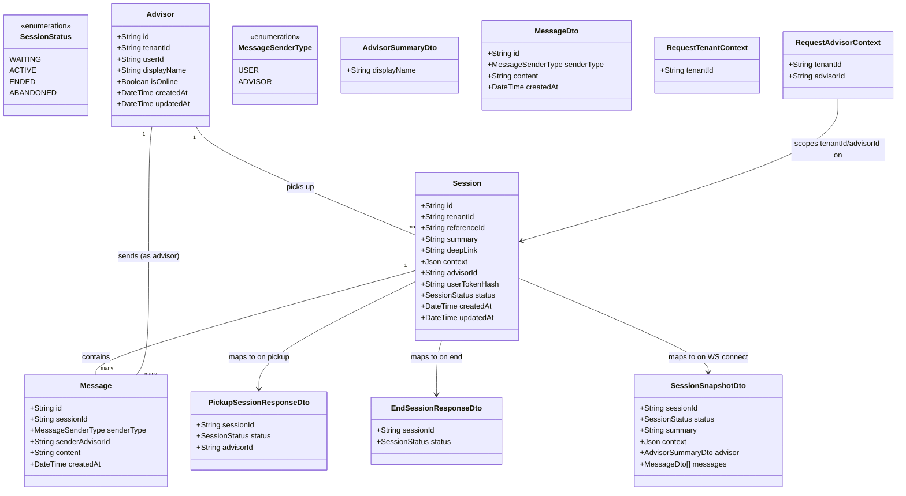

# Live 1:1 Chat Session

## Requirements

Let a tenant's advisor pick up a `waiting` session and hold a real-time,
one-to-one conversation with the handed-off user — with the summary/context they
need visible from the first moment, their identity honestly disclosed to the
user, and the conversation reliably closed out (by explicit end or by
inactivity) so no session is ever silently orphaned or double-claimed — turning
a queued handoff into a trustworthy, closed-loop live conversation, still scoped
to exactly one advisor per session and no cross-tenant visibility.

## Entities

`Advisor.userId` references a Better Auth `User.id` (the same
`User`/`Session`/`Account`/`Verification` tables 001's `BetterAuthService`
already manages) — an advisor is a Better Auth user with a linked `Advisor`
domain profile, not a separately-credentialed identity. There is no
`Advisor.credentialHash`; login/session verification is entirely Better Auth's
responsibility, reused from 001.

## Approach

1. Module & Reuse Strategy:
   - Add a third domain module, `ChatModule`, alongside 001's `TenantsModule`
     and 002's `HandoffsModule`. Extend 002's `Session` model in place (new
     `advisorId`, `userTokenHash` columns, extended `SessionStatus` enum) rather
     than introducing a parallel session-like entity — `Session` stays the one
     root record threading through 002 → 003 → (later) 004.
   - **Hard prerequisite**: this Operations section assumes features 001
     (`Tenant`, `PrismaService`, `TenantAuthGuard`, `TenantCredentialService`,
     `BusinessException`, `GlobalExceptionFilter`, `BetterAuthService`,
     `AuthController`/`/api/auth/*`) and 002 (`Session` model, `HandoffsModule`)
     already exist in `apps/api`. If they do not, their own REASONS-Canvas
     Operations MUST be executed first (or together, in dependency order 001 →
     002 → 003) — this feature does not re-specify or duplicate any of their
     infrastructure, and in particular does not stand up a second Better Auth
     configuration.
   - Two access surfaces for the advisor side, mirroring 001's tenant/operator
     split and 002's tenant-facing pattern: a REST surface
     (`AdvisorSessionsController`) for discrete state-changing actions
     (list/pickup/end), and a WebSocket gateway (`ChatGateway`) for the live
     message exchange — REST does not fit a persistent, bidirectional concern.

2. Technical Implementation:
   - New dependencies: `@nestjs/websockets` + `@nestjs/platform-socket.io`
     (Socket.IO adapter) for real-time delivery; `@nestjs/schedule` for the
     abandonment sweep. Both added to `apps/api/package.json` — first
     non-REST-request-driven infrastructure in the codebase.
   - Advisor authentication: session-based login via Better Auth, reusing 001's
     `BetterAuthService` unchanged (not a second Better Auth configuration) — an
     advisor is a Better Auth `User` with a linked `Advisor` domain profile
     (`tenantId`, `displayName`, `isOnline`), not a separately-issued opaque
     credential. A new `AdvisorAuthGuard` resolves the incoming request's Better
     Auth session cookie to a `userId` (via `BetterAuthService.getSession`),
     looks up the linked `Advisor` row by `userId`, and attaches
     `{ tenantId, advisorId }` as `RequestAdvisorContext` — the REST-side
     mechanism is structurally identical to 001's `OperatorAuthGuard`, not to
     `TenantAuthGuard`'s bearer-key pattern, since an advisor is a person
     logging in, not a source application authenticating machine-to-machine.
     Advisor provisioning (creating the Better Auth account and its linked
     `Advisor` row) remains operator-driven, same posture as 001's tenant
     provisioning — no self-serve advisor signup in v1, only now the operator
     creates a real login identity rather than issuing a static token.
   - **User session token (resolves the gap flagged in analysis)**: feature
     002's response never included a user-facing token, and this feature's
     WebSocket contract needs one. Rather than retroactively modifying 002's
     already-fixed contract, this feature adds `Session.userTokenHash`
     (nullable) and a new tenant-facing endpoint,
     `POST /handoffs/{sessionId}/user-token`, guarded by 001's existing
     `TenantAuthGuard` (reused, not duplicated) — the tenant's own backend calls
     this once, receives a raw opaque token exactly once (never persisted or
     logged in plaintext, same discipline as 001's `apiKey`), and is responsible
     for forwarding it to its own frontend/end-user. This is the one new
     endpoint this feature adds outside the `chat` module's own advisor/gateway
     surfaces, and it lives in `ChatModule` (not `HandoffsModule`, which stays
     unmodified) since the token only exists to serve this feature's WebSocket
     auth.
   - **Advisor pool clarification (resolves the ambiguity flagged in
     analysis)**: a tenant may register more than one `Advisor`; any advisor
     belonging to that tenant may pick up any of that tenant's `waiting`
     sessions — there is no per-advisor queue or ownership split before pickup.
     "One advisor pool per tenant" (v1 assumption) means exactly this: one
     shared pool of that tenant's advisors, not a hard cap of one advisor record
     per tenant.
   - Concurrency safety for pickup and end: both are single atomic conditional
     updates (`UPDATE ... WHERE id = ? AND status = 'WAITING'` / `'ACTIVE'`,
     checked by affected-row count) — the same DB-is-the-source-of-truth pattern
     002 already established for duplicate-handoff prevention, applied here to
     advisor assignment.
   - Abandonment sweep: an in-process `@nestjs/schedule` cron job (every 1
     minute) queries `active` sessions whose derived last-activity
     (`max(Session.createdAt, latest Message.createdAt)`) exceeds 30 minutes,
     batch-transitions them to `ABANDONED`, and pushes `session:ended` to any
     still-connected sockets in those sessions' rooms.
   - Global exception handling: no new `GlobalExceptionHandler`/filter — 001's
     `GlobalExceptionFilter` and `ErrorResponse` shape are reused unchanged for
     every REST path in this feature; the WebSocket gateway uses its own
     `message:rejected`/close-code error surface (a different transport, so it
     cannot route through an HTTP exception filter), described explicitly in
     Operations below.
   - **Known, explicitly accepted v1 limitation**: the WebSocket gateway runs
     in-process with no cross-instance adapter (e.g., no Redis Socket.IO
     adapter). This is correct and sufficient for v1's
     single-`apps/api`-instance deployment, but MUST NOT be assumed to survive
     horizontal scaling without adding such an adapter later — flagged here so
     it isn't rediscovered as a surprise regression.

3. Business Logic:
   - Pickup only succeeds from `WAITING`; end only succeeds from `ACTIVE` and
     only by the assigned advisor; both are terminal-adjacent, one-way
     transitions (no un-pickup, no reassignment, per FR-011).
   - A message is only ever accepted if the parent `Session.status = ACTIVE` at
     the exact moment of processing — checked against live DB state on every
     `message:send`, not cached connection-time state, closing the spec's
     explicit end/message race.
   - The advisor's `displayName` is always shown verbatim in `session:snapshot`;
     there is no code path that substitutes a placeholder — the field is
     required and non-empty at the schema level, so there is nothing to fall
     back to.
   - Session activity has no separate stored column — it's derived from
     `Message.createdAt` (and `Session.createdAt` as the floor) at sweep time,
     so "activity resets the clock" (FR-010) falls out naturally from message
     persistence with no extra write.

## Structure

### Inheritance Relationships

1. `AdvisorAuthGuard` implements Nest's `CanActivate` interface, structurally
   mirroring 001's `OperatorAuthGuard` (Better Auth session resolution), not
   `TenantAuthGuard`'s bearer-key pattern.
2. `ChatGateway` implements `OnGatewayConnection`/`OnGatewayDisconnect` (Nest
   WebSocket gateway lifecycle interfaces), decorated `@WebSocketGateway()`.
3. `AbandonmentScheduler` uses `@Cron()` from `@nestjs/schedule` — no interface
   implementation needed, a plain `@Injectable()` class.
4. New `BusinessException` subclasses (`SessionNotAvailableException`,
   `SessionNotActiveException`, `ForbiddenAdvisorAccessException`) all
   `extends BusinessException` (001's base, itself `extends HttpException`) — no
   new exception hierarchy introduced.
5. `PickupSessionDto`/`SendMessageDto`/etc. use `class-validator` decorators
   only, matching 001/002's DTO convention.

### Dependencies

1. `AdvisorSessionsController` depends on `AdvisorSessionsService`; guarded by
   `AdvisorAuthGuard`.
2. `ChatGateway` depends on `ChatService` (shared message-send/snapshot logic),
   `BetterAuthService` (reused from 001, for resolving an advisor's session
   cookie at connection time), and `UserSessionTokenService`-style token
   verification for the user side — implemented as a shared
   `resolveConnectionIdentity()` helper in `ChatService`, not duplicated guard
   logic, since WebSocket connections authenticate at `handleConnection`, not
   via Nest's HTTP guard pipeline.
3. `AdvisorSessionsService` and `ChatService` both depend on `PrismaService`
   (shared, from 001) for all `Session`/`Advisor`/`Message` reads/writes.
4. `AbandonmentScheduler` depends on `PrismaService` (for the sweep query/batch
   update) and `ChatGateway` (to push `session:ended` to affected rooms after
   the sweep).
5. `UserSessionTokenController` (new, tenant-facing) depends on
   `UserSessionTokenService` and reuses `TenantAuthGuard` from 001 — not a new
   auth mechanism.
6. `AdvisorAuthGuard` and `ChatGateway`'s advisor-side connection auth both
   depend on `BetterAuthService` (reused from 001, not reconfigured) to resolve
   a session cookie to a `userId`, then on `PrismaService` to resolve that
   `userId` to an `Advisor` row — no advisor-specific credential service exists
   in this feature (`AdvisorCredentialService` is retired by this update; see
   Norms).
7. `GlobalExceptionFilter` (registered globally by 001) covers every REST
   controller in this feature automatically; the gateway does not route through
   it (see Norms).
8. `AdvisorProvisioningController` (new, operator-facing) depends on
   `AdvisorProvisioningService` and reuses
   `OperatorAuthGuard`/`BetterAuthService` from 001 — provisioning a new advisor
   creates a Better Auth user and its linked `Advisor` row together.

### Layered Architecture

1. Controller Layer: `AdvisorSessionsController` (list/pickup/end, REST),
   `UserSessionTokenController` (mint user token, REST),
   `AdvisorProvisioningController` (operator-facing, new advisor creation) —
   parse/validate via DTOs, delegate to services, map service results to the
   exact response shapes in `contracts/advisor-sessions-api.md`.
2. Gateway Layer (new for this feature): `ChatGateway` — owns WebSocket
   connection lifecycle, room membership, and the
   `message:send`/`message:new`/`session:snapshot`/`session:ended`/`message:rejected`
   event contract from `contracts/chat-websocket-api.md`.
3. Service Layer: `AdvisorSessionsService` (pickup/end/list, atomic
   transitions), `ChatService` (shared snapshot-building and message-send logic
   used by both the gateway and, where needed, the sweep),
   `UserSessionTokenService` (mint/verify user tokens),
   `AdvisorProvisioningService` (creates a Better Auth user + linked `Advisor`
   row). `BetterAuthService` itself is reused from 001, not re-implemented here.
4. Scheduler Layer (new for this feature): `AbandonmentScheduler` — the
   codebase's first request-independent, time-triggered component.
5. Repository/Data Access Layer: `PrismaService` (reused from 001) — all
   `Session`/`Advisor`/`Message` access lives here.
6. Exception Handling Layer: `GlobalExceptionFilter` (reused, REST paths only) +
   the gateway's own `message:rejected`/WS-close-code error surface
   (transport-appropriate, not a duplicate exception hierarchy).

## Operations

### Create/Update Persistence Schema - `Session`, `Advisor`, `Message` (Prisma)

1. Responsibility: Extend 002's `Session` model and add `Advisor`/`Message` to
   `apps/api/prisma/schema.prisma`.
2. `Session` additions:
   - `advisorId`: `String?` — FK to `Advisor.id`, nullable, set exactly once at
     pickup.
   - `userTokenHash`: `String?` — nullable, set on first
     `POST /handoffs/{sessionId}/user-token` call; hash of the raw token, same
     discipline as `apiKeyHash`.
   - `status`: extend the existing `SessionStatus` enum from
     `{ WAITING, ENDED }` (002) to `{ WAITING, ACTIVE, ENDED, ABANDONED }` — a
     Prisma enum migration, additive only, does not touch 002's existing
     `WAITING`/`ENDED` semantics for rows already in those states.
3. `Advisor` (new model):
   - `id`: `String @id @default(uuid())`.
   - `tenantId`: `String` — FK to `Tenant.id`, immutable after creation.
   - `userId`: `String @unique` — FK to Better Auth's `User.id` (001's Better
     Auth Prisma models); one Better Auth user maps to at most one `Advisor`
     row. This is the field that replaces `credentialHash` under this update —
     advisor authentication is Better Auth session verification, not a
     locally-hashed credential.
   - `displayName`: `String` — required, non-empty.
   - `isOnline`: `Boolean @default(false)`.
   - `createdAt`/`updatedAt`: standard timestamps.
4. `Message` (new model):
   - `id`: `String @id @default(uuid())`.
   - `sessionId`: `String` — FK to `Session.id`.
   - `senderType`: `MessageSenderType` enum (`USER`, `ADVISOR`).
   - `senderAdvisorId`: `String?` — FK to `Advisor.id`, set only when
     `senderType = ADVISOR`.
   - `content`: `String` (text) — required, non-empty.
   - `createdAt`: `DateTime @default(now())` — the sole input to the derived
     activity computation.
5. Constraints: index `Message(sessionId, createdAt)` to make the sweep's
   per-session "latest message" lookup efficient; `Advisor.userId` unique,
   indexed (the lookup path `AdvisorAuthGuard`/`ChatGateway` use to go from a
   resolved Better Auth session to a tenant-scoped advisor).
6. Migration: additive Prisma migration on the same database/instance as 001/002
   — no new datastore; `Advisor.userId` references rows in Better Auth's own
   `User` table, already present from 001.

### Implement Service - `AdvisorProvisioningService`

1. Responsibility: The operator-driven creation path for a new advisor — owns
   the two-step "create a Better Auth login identity, then link it to a
   tenant-scoped `Advisor` profile" sequence, so no other code path creates an
   `Advisor` row.
2. Interface Definition: `provisionAdvisor`.
3. Core Methods:
   - `provisionAdvisor(tenantId: string, displayName: string, email: string): Promise<Advisor>`
     - Input Validation: `displayName` required/non-empty; `email` required,
       well-formed (already enforced by the operator-facing DTO).
     - Business Logic: create a Better Auth user via `BetterAuthService`'s
       user-creation path (email + a generated or operator-supplied initial
       credential, per Better Auth's own account-creation flow — the exact
       initial-password/invite mechanism is an implementation detail of Better
       Auth's email/password provider, not re-specified here); then create the
       linked `Advisor` row (`tenantId`, `userId: createdUser.id`,
       `displayName`, `isOnline: false`).
     - Exception Handling: an email already registered with Better Auth surfaces
       as a conflict — map to `409` via `GlobalExceptionFilter`, consistent with
       001's duplicate-slug handling shape.
     - Return Value: the created `Advisor` row (no secret to return in plaintext
       here — unlike 001's `apiKey`, Better Auth's own sign-in flow, not a
       returned token, is how the advisor subsequently authenticates).
4. Dependency Injection: `BetterAuthService` (reused from 001), `PrismaService`.

### Create Utility - `UserSessionTokenService`

1. Responsibility: Owns user-facing session token
   generation/hashing/verification — the resolution of the analysis-flagged
   token gap.
2. Methods:
   - `generateUserToken(): { raw: string; hash: string }` — 32 bytes secure
     randomness, formatted `cf_user_<base64url>`, SHA-256 hex digest as `hash`.
   - `verifyUserToken(sessionId: string, raw: string, storedHash: string): boolean`
     — constant-time comparison of `sha256(raw)` against `storedHash`.
3. Constraints: never log the raw token; a token is scoped to exactly one
   `sessionId` (it authenticates "this browser may join this one session's
   room," nothing broader).

### Implement Service - `AdvisorSessionsService`

1. Interface Definition: `listSessions`, `pickupSession`, `endSession`.
2. Core Methods:
   - `listSessions(tenantId: string, status?: SessionStatus): Promise<Session[]>`
     - Business Logic:
       `prisma.session.findMany({ where: { tenantId, status: status ?? 'WAITING' } })`
       — defaults to `WAITING` per contract; always scoped by the guard-resolved
       `tenantId`, never a request parameter (FR-001).
   - `pickupSession(tenantId: string, advisorId: string, sessionId: string): Promise<Session>`
     - Business Logic: atomic conditional update —
       `prisma.session.updateMany({ where: { id: sessionId, tenantId, status: 'WAITING' }, data: { status: 'ACTIVE', advisorId } })`;
       check `count`. If `count === 1`, re-fetch and return the updated row. If
       `count === 0`, distinguish two cases by a follow-up read: session doesn't
       exist or belongs to another tenant → throw `SessionNotFoundException`
       (`404`, reusing 001's not-found-over-forbidden convention); session
       exists but not `WAITING` → throw `SessionNotAvailableException` (`409`).
     - Exception Handling: exactly one of two concurrent callers gets
       `count === 1`; the other deterministically falls into the `409` path —
       this is what makes the guarantee atomic rather than merely likely.
   - `endSession(tenantId: string, advisorId: string, sessionId: string): Promise<Session>`
     - Business Logic: first fetch the session scoped by `tenantId` (404 if not
       found/wrong tenant). If found but `advisorId !== session.advisorId`,
       throw `ForbiddenAdvisorAccessException` (`403`) — only the assigned
       advisor may end it. Then atomic conditional update —
       `prisma.session.updateMany({ where: { id: sessionId, status: 'ACTIVE' }, data: { status: 'ENDED' } })`;
       `count === 0` (session wasn't `ACTIVE`, e.g., already ended or still
       waiting) → throw `SessionNotActiveException` (`409`).
     - Side Effect: on success, notify `ChatGateway` to broadcast
       `session:ended` (`{ sessionId, status: 'ended' }`) to the session's room
       and close both connections' ability to send further messages.
3. Dependency Injection: `PrismaService`, `ChatGateway` (for the end-triggered
   broadcast).
4. Transaction Management: pickup/end are each a single atomic `updateMany` — no
   multi-statement transaction needed; the broadcast side effect happens only
   after the DB update is confirmed successful.

### Create Guard - `AdvisorAuthGuard`

1. Responsibility: Resolve every advisor-facing REST request to
   `{ tenantId, advisorId }` from a Better Auth session cookie — structurally
   mirroring 001's `OperatorAuthGuard`, with an added lookup step to go from
   "which person" to "which advisor, at which tenant."
2. Methods:
   - `canActivate(context): Promise<boolean>`
     - Logic: call `BetterAuthService.getSession(request.headers)`; `null`
       (missing/invalid/expired session) → throw `InvalidCredentialException`
       (`401`). A resolved session → look up `Advisor` by
       `userId: session.operatorUserId` (the same session-resolution shape 001
       defined, reused here against a different linked table); no matching
       `Advisor` row (a valid Better Auth login that isn't an advisor — e.g., an
       operator-only account) → throw `InvalidCredentialException` (`401`),
       since this guard's contract is specifically "resolves to an advisor," not
       "resolves to any authenticated person." A match → attach
       `{ tenantId: advisor.tenantId, advisorId: advisor.id }` as
       `RequestAdvisorContext` on `request`, return `true`.
3. Annotations: `@UseGuards(AdvisorAuthGuard)` on `AdvisorSessionsController`.
4. Constraints: never accepts a bearer credential of any kind — the only valid
   input is a Better Auth session cookie; a session that resolves to an
   operator-only Better Auth user (no linked `Advisor`) MUST NOT be treated as
   authenticating an advisor request, and vice versa a session resolving to an
   `Advisor` MUST NOT be accepted by `OperatorAuthGuard`'s routes unless that
   same person also happens to hold an operator-level Better Auth account (out
   of scope to model further here — v1 has no role system beyond "does a linked
   `Advisor` row exist").

### Create Controller - `AdvisorProvisioningController`

1. Responsibility: Expose the operator-only advisor-creation action (FR —
   advisor provisioning is operator-driven, per Approach).
2. Routes:
   - `POST /operator/advisors` — body: `{ tenantId, displayName, email }` →
     `201` created `Advisor` summary (`id`, `tenantId`, `displayName`) | `400` |
     `409` (email already registered).
3. Annotations: `@Controller('operator/advisors')`,
   `@UseGuards(OperatorAuthGuard)` (reused from 001, unmodified) at class level.
4. Constraints: never returns any credential/password in the response — Better
   Auth's own sign-in flow (email/password, or an invite mechanism if later
   added) is how the advisor subsequently authenticates, not a token issued by
   this endpoint.

### Create Controller - `AdvisorSessionsController`

1. Responsibility: Expose the advisor REST surface (FR-001–FR-003, FR-008),
   matching `contracts/advisor-sessions-api.md` exactly.
2. Routes:
   - `GET /advisor/sessions?status=waiting` → `200` array of session summaries,
     scoped to the advisor's tenant.
   - `POST /advisor/sessions/{sessionId}/pickup` → `200`
     `PickupSessionResponseDto` | `409` | `404`.
   - `POST /advisor/sessions/{sessionId}/end` → `200` `EndSessionResponseDto` |
     `409` | `403` | `404`.
3. Annotations: `@Controller('advisor/sessions')`,
   `@UseGuards(AdvisorAuthGuard)` at class level,
   `@Query('status')`/`@Param('sessionId')` per route.
4. Constraints: reads `tenantId`/`advisorId` exclusively from
   `RequestAdvisorContext`, never from a route/query param as an override.

### Create Controller - `UserSessionTokenController`

1. Responsibility: Mint the user-facing session token this feature's WebSocket
   auth depends on — the concrete resolution of the gap flagged in analysis.
   Lives in `ChatModule`, guarded by 001's existing `TenantAuthGuard` (not
   `AdvisorAuthGuard` — this is called by the tenant's own backend, same caller
   as 002's handoff endpoint).
2. Routes:
   - `POST /handoffs/{sessionId}/user-token` → `201` `{ sessionId, userToken }`
     (raw token, shown once) — `404` if the session doesn't exist or belongs to
     another tenant; `409` if a token was already minted for this session (one
     token per session in v1; re-minting is not supported — a tenant that lost
     the token must be treated as a known v1 limitation, not silently re-issued,
     to avoid a stale client holding a token that was supposed to be
     invalidated).
3. Annotations: `@Controller('handoffs')`, `@UseGuards(TenantAuthGuard)`,
   `@Param('sessionId')`.
4. Constraints: the raw token is returned in plaintext exactly once, in this
   response only; `userTokenHash` is never returned by any endpoint afterward.

### Implement Gateway - `ChatGateway`

1. Responsibility: Own the real-time transport described in
   `contracts/chat-websocket-api.md` — connection auth, room membership, message
   relay, lifecycle broadcasts.
2. Core Methods:
   - `handleConnection(client: Socket): Promise<void>`
     - Input Validation: read `sessionId` from the connection query string; read
       the Better Auth session cookie and the `Authorization` header from the
       connection's headers (Socket.IO forwards both on the initial handshake) —
       at least one credential form is required to establish the connection.
     - Business Logic:
       - First attempt advisor resolution: call
         `BetterAuthService.getSession(client.handshake.headers)`; if it
         resolves to a `userId` with a linked `Advisor` row, confirm that
         advisor's `id` is exactly `Session.advisorId` for the target session
         (not just same-tenant) — any other advisor, or an advisor-less Better
         Auth session, is rejected for this path (falls through to the
         user-token attempt below, in case the same headers happen to also carry
         a valid user token — in practice this won't occur, but the fallback
         keeps the two paths independent rather than assuming mutual exclusivity
         by construction).
       - Otherwise (no advisor session resolved): verify the `Authorization`
         header's bearer value via
         `UserSessionTokenService.verifyUserToken(sessionId, rawToken, session.userTokenHash)`.
       - Either path: fetch the session; if `status !== 'ACTIVE'`, close the
         connection with code `4001`, reason `"session not active"`
         (contract-specified) — no room join happens for a non-active session.
       - On success: join the Socket.IO room named by `sessionId`; emit
         `session:snapshot` (built by `ChatService.buildSnapshot(sessionId)`) to
         the connecting client only.
     - Exception Handling: any auth/lookup failure closes the connection
       immediately (no partial join, no leaked session data).
   - `handleMessageSend(client: Socket, data: { content: string }): Promise<void>`
     (bound to the `message:send` client event)
     - Input Validation: `content` non-empty; reject with `message:rejected`
       (`{ reason: 'invalid_content' }`) otherwise, without touching the DB.
     - Business Logic: re-fetch the session's live `status` from the DB (never
       the connection's cached state) — if not `ACTIVE`, emit `message:rejected`
       (`{ reason: 'session_not_active' }`) to the sender only, do not persist,
       do not broadcast. If `ACTIVE`: persist a `Message` (`senderType` and
       `senderAdvisorId` derived from which credential type authenticated this
       connection at `handleConnection` time, stored on the socket's session
       data), then broadcast `message:new` to the full room (both parties,
       including the sender — consistent client-side rendering).
     - Exception Handling: this is the exact race the spec calls out (message
       vs. end/abandon) — the live-DB-state check at send time, not connect
       time, is what closes it.
   - `handleDisconnect(client: Socket): void`
     - Business Logic: leave the room (Socket.IO default behavior); no session
       state change — a disconnect alone never ends or abandons a session
       (that's the sweep's job, or an explicit `end` call).
3. Annotations: `@WebSocketGateway({ path: '/chat' })`,
   `@SubscribeMessage('message:send')` on the handler above.
4. Dependency Injection: `ChatService`, `BetterAuthService` (reused from 001),
   `UserSessionTokenService`, `PrismaService`.

### Implement Service - `ChatService`

1. Interface Definition: `buildSnapshot`, `resolveConnectionIdentity` (shared by
   `ChatGateway` for both the initial connect and any place needing the same
   lookup).
2. Core Methods:
   - `buildSnapshot(sessionId: string): Promise<SessionSnapshotDto>`
     - Business Logic: fetch `Session` (with `Advisor` and ordered `Message`
       history); map to `SessionSnapshotDto` exactly as shown in
       `contracts/chat-websocket-api.md` — `advisor.displayName` always
       populated, never omitted or replaced.
3. Dependency Injection: `PrismaService`.

### Implement Scheduler - `AbandonmentScheduler`

1. Responsibility: The feature's sole background, request-independent process —
   sweeps `ACTIVE` sessions past the inactivity window into `ABANDONED`
   (FR-009).
2. Methods:
   - `sweepInactiveSessions(): Promise<void>` — `@Cron('*/1 * * * *')` (every 1
     minute)
     - Logic:
       - Query `ACTIVE` sessions where
         `now - GREATEST(Session.createdAt, MAX(Message.createdAt) over that session) > 30 minutes`
         (a single aggregate query, not N+1 per session).
       - Batch-update matched sessions to `ABANDONED` via `updateMany` guarded
         on `status = 'ACTIVE'` (defends against a session being picked to
         `ended` by a racing explicit `end` call in the same window — the guard
         means the sweep only affects rows still genuinely `ACTIVE` at update
         time).
       - For each session actually transitioned (use the update's affected rows,
         not the pre-update query result, to avoid double-notifying a session an
         explicit `end` beat the sweep to), instruct `ChatGateway` to broadcast
         `session:ended` (`{ sessionId, status: 'abandoned' }`) to that
         session's room.
3. Dependency Injection: `PrismaService`, `ChatGateway`.
4. Constraints: the 30-minute window is a named constant (e.g.,
   `ABANDONMENT_INACTIVITY_MINUTES = 30`), not hardcoded inline, so it can be
   tuned without touching sweep logic, per the spec's own "adjustable later"
   assumption.

### Create Business Exceptions

1. Inheritance: `SessionNotAvailableException`, `SessionNotActiveException`,
   `ForbiddenAdvisorAccessException` all `extends BusinessException` (001's
   base).
2. Attributes: each fixes its own HTTP status/message at construction —
   `SessionNotAvailableException` → `409`,
   `"Session is not available for pickup"`; `SessionNotActiveException` → `409`,
   `"Session is not active"`; `ForbiddenAdvisorAccessException` → `403`,
   `"Session is assigned to a different advisor"`.
3. Usage Scenarios: thrown exactly at the points described in
   `AdvisorSessionsService`'s Operations above; none of these are used by
   `ChatGateway`, which uses `message:rejected`/close codes instead (different
   transport, see Norms).

## Norms

1. Annotation Standards: REST controllers/guards follow 001/002's exact
   conventions (`@Controller()`, class-level `@UseGuards()`, `class-validator`
   DTOs); the gateway uses `@WebSocketGateway()`/`@SubscribeMessage()` — the
   only new annotation family this feature introduces, and it is not mixed with
   HTTP-guard annotations (the gateway authenticates itself in
   `handleConnection`, not via `@UseGuards`).
2. Dependency Injection: constructor injection only, matching 001/002;
   `ChatGateway` and `AbandonmentScheduler` inject services the same way
   controllers do — no special-casing for being non-controller entry points.
3. Exception Handling:
   - REST paths: identical discipline to 001/002 — every business-rule failure
     throws a `BusinessException` subclass, caught uniformly by the existing
     `GlobalExceptionFilter`, no new error-response shape.
   - WebSocket path: exceptions are NOT thrown across the gateway boundary to a
     filter — `ChatGateway` catches its own failure conditions and emits
     `message:rejected` (for send failures) or closes the connection with a
     specific code (for connection-time failures), since Nest's
     `GlobalExceptionFilter` does not apply to the WS transport. This asymmetry
     is deliberate, not an inconsistency to "fix."
4. Data Validation: REST DTOs (`SendMessageDto` is used only for validating
   structure inside `handleMessageSend`, not as a Nest pipe-validated `@Body()`,
   since the WS transport does not run through `ValidationPipe`) — the gateway
   performs its own lightweight validation (`content` non-empty) inline.
5. Logging: never log the user token's raw value or an advisor's Better Auth
   session cookie/password, same rule as 001's credential logging discipline;
   message `content` MAY contain sensitive end-user conversation text — do not
   log full message bodies at info level, log only
   `sessionId`/`messageId`/`senderType` for tracing.
6. Documentation Standards: `contracts/advisor-sessions-api.md` and
   `contracts/chat-websocket-api.md` remain the binding source of truth for both
   surfaces' shapes; this Operations section must not diverge from either.
7. Auth Configuration: no advisor-specific credential-hashing utility exists in
   this feature (`AdvisorCredentialService` is retired by this update) — every
   advisor-authentication touch point calls 001's `BetterAuthService` directly;
   introducing a second, locally-hashed advisor credential mechanism alongside
   Better Auth would be a regression, not an alternative.

## Safeguards

1. Functional Constraints: every advisor REST route MUST be behind
   `AdvisorAuthGuard`; every WebSocket connection MUST be authenticated in
   `handleConnection` before any room join or data is sent; the DTO/query
   surfaces MUST NOT accept `tenantId` or `advisorId` overrides from the client
   under any field name (FR-001 boundary, inherited from 001).
2. Performance Constraints: pickup-to-first-message MUST be achievable in under
   10 seconds end-to-end (SC-001) — no artificial delay in pickup,
   snapshot-building, or connection establishment; message relay MUST target
   under 500ms server-side relay latency under normal load (SC-002 support).
3. Security Constraints: the user token follows the exact plaintext-once
   discipline established by 001 (`apiKey`) — never logged, never persisted
   unhashed, never returned by any endpoint after its single issuance response,
   and it authenticates exactly one `sessionId`, MUST NOT be accepted for any
   other session. Advisor authentication carries no locally-issued secret at all
   — it MUST go through Better Auth's session cookie exclusively (`httpOnly`,
   `secure`, per 001's Safeguards), and no code path in this feature may
   generate, store, or compare an advisor-specific credential hash.
4. Integration Constraints: this feature MUST NOT modify 001's
   `TenantsModule`/`TenantAuthGuard`/`OperatorAuthGuard`/`BetterAuthService`/`Tenant`
   schema or 002's `HandoffsModule`/`HandoffsController`/`HandoffsService` — it
   only extends the shared `Session` model, reuses 001's Better Auth
   infrastructure as-is, and adds `ChatModule` alongside them; MUST NOT
   introduce any queueing, multi-advisor routing, or reassignment mechanism
   (FR-011, hard exclusion — resist building "for later" even though it may look
   convenient while the pickup/assignment code is already being written); MUST
   NOT stand up a second Better Auth server instance or a parallel
   advisor-credential mechanism as a fallback.
5. Business Rule Constraints: pickup and end MUST both be single atomic
   conditional updates (never read-then-write) — this is the same non-negotiable
   pattern 002 established for duplicate-handoff prevention, applied here to
   advisor assignment and session termination; a message MUST be validated
   against live DB session state at send time, never connection-time cached
   state.
6. Exception Handling Constraints:
   - Every new `BusinessException` subclass (REST path only) MUST map to exactly
     one HTTP status and a fixed, non-internal message, handled solely by the
     existing `GlobalExceptionFilter` — no ad hoc REST error formatting in this
     feature's controllers.
   - The WebSocket path MUST NOT throw unhandled exceptions into the gateway's
     own event handlers — every failure path in
     `handleConnection`/`handleMessageSend` MUST resolve to either a defined
     close code or a `message:rejected` emission, never an uncaught error that
     could crash the gateway process or hang the connection.
   - Cross-tenant/cross-advisor access attempts MUST return `404`/`403` exactly
     as specified in `contracts/advisor-sessions-api.md` — never a status or
     message that confirms another tenant's session exists (isolation guarantee
     inherited from 001, extended to this feature's own resources).
7. Technical Constraints: the Socket.IO gateway runs in-process with no
   cross-instance adapter in v1 — this is an accepted, explicit limitation for a
   single-`apps/api`-instance deployment, and MUST be revisited (e.g., a
   Redis-backed Socket.IO adapter) before any horizontal scaling of `apps/api`,
   not discovered as a production incident; the abandonment sweep query MUST be
   a single aggregate query per run, not N+1 per active session.
8. Data Constraints: `Message.content` MUST be persisted and broadcast unchanged
   (no truncation, no reformatting); `Advisor.displayName` MUST be non-empty at
   the schema level with no application-level fallback value, so "never show a
   placeholder" (FR-007) is structurally guaranteed, not just conventionally
   followed; the `SessionStatus` enum's `WAITING`/`ENDED` values and their
   existing 002 semantics MUST remain unchanged by this feature's additive
   migration.
9. API Constraints: REST response shapes/status codes MUST exactly match
   `contracts/advisor-sessions-api.md`; WebSocket event names/payloads MUST
   exactly match `contracts/chat-websocket-api.md` (`session:snapshot`,
   `message:new`, `session:ended`, `message:send`, `message:rejected`) — both
   contracts are binding, not illustrative, for this implementation, consistent
   with how 001's and 002's contracts were treated.
