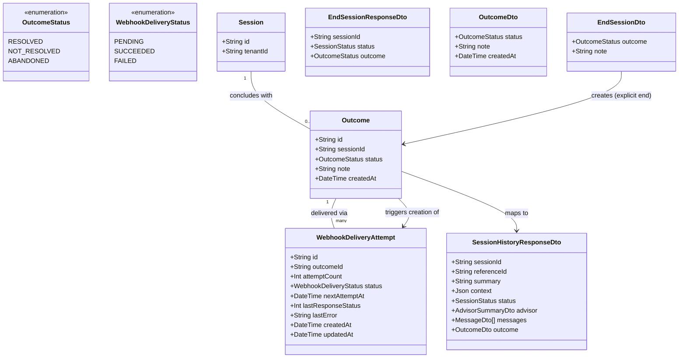

# Session Outcome & Callback

## Requirements

Close the loop back to the tenant that started a handoff: the moment a session
concludes, record exactly one neutral, fixed-vocabulary outcome (with an
optional advisor note) and reliably deliver a signed, retried webhook carrying
the tenant's own reference ID and that outcome — while keeping the full session
record (context, transcript, outcome) permanently retrievable regardless of
delivery success — so a tenant can trust it always learns what happened, and
Crossfade's own operator can always look back at what happened, without either
guarantee depending on the other.

## Entities

## Approach

1. Module & Resolution of the 003-Coupling Question:
   - Add a fourth and terminal domain module, `OutcomesModule`, alongside 001's
     `TenantsModule`, 002's `HandoffsModule`, and 003's `ChatModule`. Analysis
     flagged that FR-007's exactly-once guarantee genuinely requires _something_
     at both of 003's terminal-transition sites (explicit end, abandonment
     sweep) to trigger outcome recording — this is resolved here as a **small,
     direct, targeted extension of two existing 003 methods**, not a new
     event-bus dependency: `AdvisorSessionsService.endSession()` and
     `AbandonmentScheduler.sweepInactiveSessions()` (both from 003) each gain
     one call into this feature's `OutcomesService` after their own DB
     transition succeeds. No `@nestjs/event-emitter` or similar is introduced —
     at exactly two call sites, a direct injected-service call is simpler and
     equally decoupled in the sense that matters (`OutcomesService` owns all
     outcome logic; 003's methods just report "I concluded a session," which is
     copy-comparable to how 002/003 already reuse each other's guards/services
     directly rather than through events).
   - `AdvisorSessionsController`'s `POST /advisor/sessions/{sessionId}/end`
     route (003) is extended, not duplicated, to accept the new `EndSessionDto`
     body (`outcome`, `note`) — matching `contracts/session-history-api.md`'s
     framing of this as the _same_ endpoint gaining new required fields, not a
     second endpoint.
   - **Hard prerequisite**: this Operations section assumes 001 (`Tenant`,
     `PrismaService`, `TenantAuthGuard`, `BusinessException`,
     `GlobalExceptionFilter`), 002 (`Session` model), and 003 (`Session`
     terminal states, `Advisor`, `Message`, `AdvisorSessionsService`,
     `AdvisorSessionsController`, `AbandonmentScheduler`, `AdvisorAuthGuard`)
     already exist in `apps/api`. If they do not, their own REASONS-Canvas
     Operations MUST be executed first, in order 001 → 002 → 003 → 004.

2. Technical Implementation:
   - Exactly-once outcome recording: `Outcome.sessionId` is a unique column.
     Both call sites (extended `endSession`, extended sweep) attempt an insert;
     a unique-constraint violation (Prisma `P2002`) means the other path already
     won, and that path's caller proceeds normally without erroring — the same
     "database is the single source of truth for a race" pattern already used in
     002 (duplicate handoff) and 003 (concurrent pickup).
   - Webhook signing: HMAC-SHA256 over the _exact raw bytes_ of the JSON body
     actually transmitted (compute the signature from the same serialized string
     used as the HTTP request body — never re-serialize the payload object
     separately for signing vs. sending, which would risk a byte-level
     mismatch), keyed by `Tenant.webhookSecret` read fresh from the database at
     delivery time (never cached from session/handoff creation), satisfying
     FR-009.
   - Retry/backoff: a `WebhookDeliveryAttempt` row is created
     (`status: PENDING`, `nextAttemptAt: now`) in the same operation that
     successfully records the `Outcome` (only by the winning insert, never by
     the losing path). A periodic `@nestjs/schedule` job (reusing 003's
     in-process scheduler pattern, no new infrastructure dependency) sweeps due
     attempts, performs the HTTP call, and updates status/backoff.
   - Global exception handling: no new `GlobalExceptionHandler`/filter — 001's
     `GlobalExceptionFilter` and `ErrorResponse` shape are reused unchanged for
     the REST paths this feature adds/extends (`end`, `history`). Webhook
     delivery failures are never surfaced as thrown exceptions to any caller —
     they are internal state on `WebhookDeliveryAttempt`, consistent with
     FR-005's independence guarantee.

3. Business Logic:
   - An explicit end MUST include a valid `outcome` (`resolved` or
     `not_resolved`) — `abandoned` is never advisor-selectable via this path; a
     missing or invalid `outcome` is rejected before any state change (session
     stays `active`, no `Outcome` created).
   - An automated abandonment MUST always record `outcome: abandoned` with
     `note: null` — no advisor input is solicited or accepted for this path.
   - `note`, when present, MUST be ≤500 characters; over-length input is
     rejected outright (`400`), never silently truncated, so the
     stored/delivered note is always a faithful, complete copy of what the
     advisor wrote.
   - Delivery success or failure MUST NEVER affect `Outcome` retrievability —
     `Outcome` and `WebhookDeliveryAttempt` are read and written as independent
     records; a session-history read never joins against delivery status.
   - Session history is only exposed once a session has reached a terminal state
     (`ended` or `abandoned`); a non-terminal session's history request returns
     `404`, matching 001's isolation-preserving "don't confirm what you can't
     show" convention.

## Structure

### Inheritance Relationships

1. No new inheritance beyond `BusinessException` subclasses
   (`InvalidOutcomeException`, `NoteTooLongException`)
   `extends BusinessException` (001's base).
2. `EndSessionDto`, `SessionHistoryResponseDto`, `OutcomeDto` use
   `class-validator` decorators only, matching 001–003's DTO convention.
3. `WebhookRetryScheduler` uses `@Cron()` from `@nestjs/schedule`, the same
   pattern as 003's `AbandonmentScheduler` — no new scheduling abstraction
   introduced.

### Dependencies

1. `OutcomesService` depends on `PrismaService` (shared, from 001) for
   `Outcome`/`WebhookDeliveryAttempt` reads/writes.
2. `AdvisorSessionsService` (003, extended) now also depends on
   `OutcomesService` — injected, called once after its own atomic
   `active → ended` transition succeeds.
3. `AbandonmentScheduler` (003, extended) now also depends on `OutcomesService`
   — injected, called once per session actually transitioned to `ABANDONED` in
   each sweep run.
4. `WebhookSigningService` depends on `PrismaService` (to read
   `Tenant.webhookSecret` fresh) — depended on by `WebhookDeliveryService`.
5. `WebhookDeliveryService` depends on `WebhookSigningService` and
   `PrismaService`; depended on by `WebhookRetryScheduler`.
6. `SessionHistoryController` depends on a read-composition helper
   (`OutcomesService.getSessionHistory` or equivalent) that queries `Session` +
   `Message` (003) + `Outcome` (this feature) together, scoped by `tenantId`.
7. `GlobalExceptionFilter` (001, global) covers every REST route this feature
   adds/extends automatically.

### Layered Architecture

1. Controller Layer: `AdvisorSessionsController` (003, extended — `end` route
   now requires outcome/note), `SessionHistoryController` (new) — both guarded
   by 003's existing `AdvisorAuthGuard`, no new auth mechanism.
2. Service Layer: `OutcomesService` (owns exactly-once outcome recording, both
   trigger paths; owns session-history composition), `WebhookSigningService`
   (HMAC signing), `WebhookDeliveryService` (performs one delivery attempt,
   updates backoff state).
3. Scheduler Layer: `WebhookRetryScheduler` (new, mirrors 003's
   `AbandonmentScheduler` pattern) — the feature's own request-independent,
   time-triggered component.
4. Repository/Data Access Layer: `PrismaService` (reused from 001) — all
   `Outcome`/`WebhookDeliveryAttempt` access lives here.
5. Exception Handling Layer: `GlobalExceptionFilter` (reused, REST paths only) —
   webhook delivery failures never reach this layer, by design (they're data,
   not exceptions).

## Operations

### Create/Update Persistence Schema - `Outcome`, `WebhookDeliveryAttempt` (Prisma)

1. Responsibility: Add both new models to `apps/api/prisma/schema.prisma`,
   referencing 003's `Session` — no changes to `Session`'s own columns.
2. `Outcome`:
   - `id`: `String @id @default(uuid())`.
   - `sessionId`: `String @unique` — FK to `Session.id`; the uniqueness
     constraint IS the exactly-once mechanism (FR-007, SC-006).
   - `status`: `OutcomeStatus` enum (`RESOLVED`, `NOT_RESOLVED`, `ABANDONED`).
   - `note`: `String?` — nullable, max 500 chars enforced at the DTO layer, not
     the DB (DB column unconstrained-length `text`, application is the source of
     truth for the limit so the error message stays clean).
   - `createdAt`: `DateTime @default(now())`.
3. `WebhookDeliveryAttempt`:
   - `id`: `String @id @default(uuid())`.
   - `outcomeId`: `String` — FK to `Outcome.id`.
   - `attemptCount`: `Int @default(0)`.
   - `status`: `WebhookDeliveryStatus` enum (`PENDING`, `SUCCEEDED`, `FAILED`).
   - `nextAttemptAt`: `DateTime?` — null once `SUCCEEDED`/`FAILED`.
   - `lastResponseStatus`: `Int?`.
   - `lastError`: `String?`.
   - `createdAt`/`updatedAt`: standard timestamps.
4. Constraints: index `WebhookDeliveryAttempt(status, nextAttemptAt)` for the
   retry sweep's due-attempt query; `Outcome.sessionId` unique index doubles as
   the query path for session-history composition.
5. Migration: additive Prisma migration on the same database/instance as 001–003
   — no new datastore.

### Implement Service - `OutcomesService`

1. Interface Definition: `recordExplicitOutcome`, `recordAutoAbandonedOutcome`,
   `getSessionHistory`.
2. Core Methods:
   - `recordExplicitOutcome(sessionId: string, status: 'RESOLVED' | 'NOT_RESOLVED', note?: string): Promise<Outcome>`
     - Input Validation: `status` and `note` already validated by
       `EndSessionDto`'s `ValidationPipe` (status required and one of the two
       advisor-selectable values; note ≤500 chars if present) before this method
       is called.
     - Business Logic: attempt
       `prisma.outcome.create({ data: { sessionId, status, note: note ?? null } })`.
       On success: also create the first `WebhookDeliveryAttempt`
       (`status: PENDING`, `nextAttemptAt: now`) in the same logical operation,
       and return the created `Outcome`. On a `P2002` unique-violation (someone
       else — the sweep, in a genuine race — already recorded this session's
       outcome): re-fetch and return the existing `Outcome` without creating a
       second delivery attempt; do not treat this as an error to the caller
       (`AdvisorSessionsService`'s `endSession` still returns its own `200`
       normally).
     - Exception Handling: any other Prisma error propagates to
       `GlobalExceptionFilter` as a genuine `500` — only `P2002` on this
       specific constraint is treated as "already recorded."
   - `recordAutoAbandonedOutcome(sessionId: string): Promise<void>`
     - Business Logic: same insert-or-detect-conflict pattern as above, with
       `status: 'ABANDONED'`, `note: null`, called once per session the sweep
       actually transitioned to `ABANDONED` this run. Errors within one
       session's outcome recording MUST NOT abort the sweep's processing of
       other sessions in the same batch — each session's outcome recording is
       independently try/caught within the sweep's loop.
   - `getSessionHistory(tenantId: string, sessionId: string): Promise<SessionHistoryResponseDto>`
     - Business Logic: fetch `Session` scoped by `tenantId` and
       `status IN ('ENDED', 'ABANDONED')`, with its `Advisor`, ordered `Message`
       list, and `Outcome` — if the session doesn't exist, belongs to another
       tenant, or hasn't concluded, throw `SessionNotFoundException` (`404`,
       same indistinguishable-from-nonexistent convention as 003). If found,
       `outcome` MUST be present — its absence would indicate a bug in the
       exactly-once guarantee, not a valid state, so this method does not
       defensively handle a missing `Outcome` as anything other than an
       unexpected `500`.
3. Dependency Injection: `PrismaService`.
4. Transaction Management: `Outcome` creation and its first
   `WebhookDeliveryAttempt` creation happen as two sequential statements within
   the same method call (not a DB transaction) — acceptable because only the
   winning `Outcome` insert reaches the second statement; the losing path never
   executes it, so there's no risk of an orphaned delivery attempt from a losing
   writer.

### Extend Service - `AdvisorSessionsService` (003)

1. Responsibility: `endSession` gains outcome recording as its final step, after
   its existing atomic `active → ended` transition succeeds — no change to the
   transition logic itself.
2. Methods:
   - `endSession(tenantId: string, advisorId: string, sessionId: string, dto: EndSessionDto): Promise<{ session: Session; outcome: Outcome }>`
     - Logic: unchanged existing steps (fetch, ownership check → `403`, atomic
       conditional update → `409` if not `ACTIVE`) followed by a new final step:
       call
       `OutcomesService.recordExplicitOutcome(sessionId, dto.outcome, dto.note)`
       and return both the updated `session` and the resulting `outcome` to the
       controller.
     - Constraint: `dto.outcome` is validated as required and one of
       `RESOLVED`/`NOT_RESOLVED` before this method is even invoked (DTO-level
       `ValidationPipe`) — this method never receives an invalid or missing
       outcome value.

### Extend Scheduler - `AbandonmentScheduler` (003)

1. Responsibility: `sweepInactiveSessions` gains a per-transitioned-session
   outcome-recording step, after its existing batch `ACTIVE → ABANDONED` update
   — no change to the sweep's selection query or backoff-unrelated logic.
2. Methods:
   - `sweepInactiveSessions(): Promise<void>` (unchanged `@Cron` schedule
     from 003)
     - Logic: unchanged existing steps (query + batch `updateMany` guarded on
       `status = 'ACTIVE'`) followed by a new step: for each session ID actually
       affected by the update (not the pre-update candidate list), call
       `OutcomesService.recordAutoAbandonedOutcome(sessionId)`, independently
       try/caught per session as described in `OutcomesService`'s Operations
       above, then (as 003 already does) instruct `ChatGateway` to broadcast
       `session:ended`.

### Create DTO - `EndSessionDto`

1. Responsibility: Validate the extended request body for
   `POST /advisor/sessions/{sessionId}/end`, per
   `contracts/session-history-api.md`.
2. Attributes:
   - `outcome`: `'resolved' | 'not_resolved'` —
     `@IsIn(['resolved', 'not_resolved']) @IsNotEmpty()`; required, `abandoned`
     is not an accepted input value here (schema-level exclusion, not just
     documentation).
   - `note`: `string?` — `@IsOptional() @IsString() @MaxLength(500)`.
3. Constraints: `ValidationPipe` rejects a missing/invalid `outcome` or an
   over-500-character `note` with `400` before the controller's handler runs —
   the service layer never sees an invalid combination.

### Create/Update DTOs - `EndSessionResponseDto`, `SessionHistoryResponseDto`, `OutcomeDto`

1. `EndSessionResponseDto` (extends 003's response shape):
   `{ sessionId, status, outcome }` — `outcome` is the new field this feature
   adds to the existing `200` response, matching
   `contracts/session-history-api.md`.
2. `SessionHistoryResponseDto`:
   `{ sessionId, referenceId, summary, context, status, advisor: { displayName }, messages: MessageDto[], outcome: OutcomeDto }`
   — exact shape from `contracts/session-history-api.md`; `outcome` is always
   present (never `null`) for any session this endpoint successfully returns.
3. `OutcomeDto`: `{ status, note, createdAt }` — `note` omitted (not `null`)
   when absent, matching the webhook payload's own "omit rather than null"
   convention for consistency across this feature's two output surfaces.

### Create Controller - `SessionHistoryController`

1. Responsibility: Expose `GET /advisor/sessions/{sessionId}/history` (FR-005,
   US4).
2. Routes:
   - `GET /advisor/sessions/{sessionId}/history` → `200`
     `SessionHistoryResponseDto` | `404` (doesn't exist, wrong tenant, or not
     yet concluded — indistinguishable, per 001's convention).
3. Annotations: `@Controller('advisor/sessions')` (same route prefix as 003's
   `AdvisorSessionsController` — implementer may add this route to that existing
   controller instead of a new one, whichever keeps the module's controller
   surface simplest; behavior is identical either way),
   `@UseGuards(AdvisorAuthGuard)`.
4. Constraints: scoped exclusively by the guard-resolved `tenantId` — no
   tenant/session override accepted from any request field.

### Implement Service - `WebhookSigningService`

1. Interface Definition: `sign`.
2. Core Methods:
   - `sign(tenantId: string, rawBody: string): Promise<string>`
     - Business Logic: fetch `Tenant.webhookSecret` fresh via `PrismaService`
       (never cached), compute `HMAC-SHA256(webhookSecret, rawBody)` using
       Node's built-in `crypto`, return as `sha256=<hex>` — the exact header
       value format from `contracts/outcome-webhook.md`.
     - Constraint: `rawBody` MUST be the literal string that will be transmitted
       as the HTTP body — callers MUST serialize the payload once and pass that
       exact string to both `sign()` and the outgoing HTTP request, never
       serializing twice.
3. Dependency Injection: `PrismaService`.

### Implement Service - `WebhookDeliveryService`

1. Interface Definition: `attemptDelivery`.
2. Core Methods:
   - `attemptDelivery(attemptId: string): Promise<void>`
     - Business Logic: fetch the `WebhookDeliveryAttempt` (with its `Outcome`
       and the `Outcome`'s `Session`/`Tenant`); build the payload exactly as
       `contracts/outcome-webhook.md` specifies (`referenceId`, `outcome`,
       `note` — omitted if absent — `sessionId`, `concludedAt`); serialize once;
       sign via `WebhookSigningService.sign(tenantId, rawBody)`; POST to
       `Tenant.webhookUrl` with `Content-Type: application/json`,
       `X-Crossfade-Signature`, `X-Crossfade-Delivery-Attempt` headers.
     - On a `2xx` response: update the attempt to `status: SUCCEEDED`,
       `nextAttemptAt: null`, `lastResponseStatus` set.
     - On any other response or a timeout: increment `attemptCount`; if
       `attemptCount` has reached the bounded cap (implementation constant, e.g.
       6), set `status: FAILED`, `nextAttemptAt: null`; otherwise compute the
       next backoff delay from the fixed exponential schedule (e.g. 1m, 5m, 30m,
       2h, 12h) and set `nextAttemptAt` accordingly, keep `status: PENDING`.
       Record `lastResponseStatus`/`lastError` in both cases.
     - Exception Handling: this method never throws to its caller
       (`WebhookRetryScheduler`) for delivery-related failures (non-2xx,
       timeout, network error) — those are all captured as the "failure" branch
       above, updating DB state, not propagating an exception; only a genuine
       internal error (e.g., DB write failure) propagates and is logged by the
       scheduler's own try/catch per attempt.
3. Dependency Injection: `PrismaService`, `WebhookSigningService`, an HTTP
   client (Nest's `HttpService`/`fetch`, implementer's choice, no new
   heavyweight dependency needed for a single outbound POST).

### Implement Scheduler - `WebhookRetryScheduler`

1. Responsibility: The feature's own background sweep — delivers/retries due
   `WebhookDeliveryAttempt` rows (FR-003).
2. Methods:
   - `sweepDueDeliveries(): Promise<void>` — `@Cron('*/1 * * * *')` (every 1
     minute, same cadence as 003's abandonment sweep, kept simple rather than
     tuned separately for v1)
     - Logic: query `WebhookDeliveryAttempt` rows where
       `status = 'PENDING' AND nextAttemptAt <= now`; for each, call
       `WebhookDeliveryService.attemptDelivery(id)`, independently try/caught
       per attempt so one failing HTTP call or unexpected error never blocks the
       rest of the batch.
3. Dependency Injection: `PrismaService`, `WebhookDeliveryService`.
4. Constraints: this query MUST be scoped strictly to `WebhookDeliveryAttempt`,
   sharing no table or row-selection logic with 003's `AbandonmentScheduler`
   (which queries `Session`) — the two sweeps are independent and MUST NOT be
   merged into one job, to keep each one's failure mode isolated from the
   other's.

### Create Business Exceptions

1. Inheritance: `InvalidOutcomeException`, `NoteTooLongException`
   `extends BusinessException` (001's base) — though in practice both are
   expected to be raised by `ValidationPipe` against `EndSessionDto`'s
   decorators rather than thrown manually; these classes exist for any
   manual-validation edge case the DTO layer doesn't cover (e.g., a future
   non-DTO entry point).
2. Attributes: `InvalidOutcomeException` → `400`,
   `"outcome is required and must be one of: resolved, not_resolved"`;
   `NoteTooLongException` → `400`, `"note must be 500 characters or fewer"`.
3. Usage Scenarios: primarily documentation of the exact validation-failure
   messages `EndSessionDto`'s `ValidationPipe` errors should read as — no
   `SessionNotFoundException`/`SessionNotActiveException`/`ForbiddenAdvisorAccessException`
   duplication needed, since `endSession`'s existing 003 exceptions already
   cover those paths unchanged.

## Norms

1. Annotation Standards: `SessionHistoryController` and the extended `end` route
   follow 001–003's exact conventions (`@Controller()`, class-level
   `@UseGuards(AdvisorAuthGuard)`, `class-validator` DTOs);
   `WebhookRetryScheduler` uses `@Cron()`, matching 003's `AbandonmentScheduler`
   precedent exactly — no new annotation family introduced by this feature.
2. Dependency Injection: constructor injection only; `AdvisorSessionsService`
   and `AbandonmentScheduler` (both 003) inject `OutcomesService` the same way
   any other cross-module service dependency is wired in this codebase — no new
   DI pattern.
3. Exception Handling:
   - REST paths (`end`, `history`) reuse 001's `ErrorResponse` shape and
     `GlobalExceptionFilter` unchanged.
   - Webhook delivery failures are explicitly NOT modeled as exceptions anywhere
     in the call chain — they are `WebhookDeliveryAttempt` state, full stop; a
     reviewer should treat any `throw` inside
     `WebhookDeliveryService.attemptDelivery`'s non-2xx/timeout branch as a bug,
     not an oversight to "fix" later.
4. Data Validation: `outcome`/`note` validated once, at the `EndSessionDto`
   layer, exactly as 001–003 validate their own DTOs — no duplicate validation
   inside `OutcomesService`.
5. Logging: `note` MAY contain sensitive conversation-adjacent content (same
   category as 003's message `content`) — do not log full note text at info
   level; log `sessionId`/`outcomeId`/`status` for tracing. Webhook delivery
   logging MUST include `attemptCount`/`lastResponseStatus` but MUST NOT log the
   tenant's `webhookSecret` or the computed signature value.
6. Documentation Standards: `contracts/outcome-webhook.md` and
   `contracts/session-history-api.md` remain the binding source of truth for
   both the outbound payload/signing scheme and the extended `end`/`history`
   REST shapes; this Operations section must not diverge from either.

## Safeguards

1. Functional Constraints: `end` MUST reject a request with a missing or invalid
   `outcome` before any session state change occurs (no partial transition, no
   `Outcome` created on a rejected request); the abandonment sweep MUST NEVER
   accept or solicit an advisor-supplied outcome for a session it transitions to
   `ABANDONED`.
2. Performance Constraints: outcome recording (both trigger paths) MUST NOT
   block on webhook delivery — creating the first `WebhookDeliveryAttempt` row
   is a fast DB write, not a synchronous HTTP call; the retry sweep's
   due-attempt query MUST be a single indexed query per run, not N+1.
3. Security Constraints: `webhookSecret` MUST be read fresh from `Tenant` at
   delivery time, never cached across a session's lifetime (FR-009); the HMAC
   signature MUST be computed over the exact bytes transmitted as the request
   body, with no independent re-serialization; `webhookSecret` and computed
   signatures MUST NEVER be logged.
4. Integration Constraints: this feature MUST NOT modify 001's `TenantsModule`,
   002's `HandoffsModule`, or 003's `Session` schema, `ChatGateway`,
   `AdvisorAuthGuard`, or pickup logic — its only touch points into 003 are the
   two explicitly-listed extensions (`AdvisorSessionsService.endSession`'s final
   step, `AbandonmentScheduler.sweepInactiveSessions`'s final step), both
   additive, neither altering existing behavior those methods already guarantee.
5. Business Rule Constraints: `Outcome.sessionId` uniqueness MUST be enforced at
   the database level, never solely by an application-level check-then-insert —
   this is the same non-negotiable pattern used by every prior feature's own
   race-prevention design (002, 003); a `note` over 500 characters MUST be
   rejected, never silently truncated.
6. Exception Handling Constraints:
   - REST validation/business-rule failures MUST go through the existing
     `GlobalExceptionFilter`/`ErrorResponse` shape — no ad hoc formatting in
     `SessionHistoryController` or the extended `end` handler.
   - Webhook delivery failures (any non-2xx response, timeout, or network error)
     MUST NEVER be thrown as exceptions that could propagate to
     `GlobalExceptionFilter` or crash the retry scheduler's sweep loop — they
     MUST be captured as `WebhookDeliveryAttempt` state updates only.
   - A losing writer in the exactly-once outcome race (`P2002` on
     `Outcome.sessionId`) MUST NOT surface as an error to its caller —
     `endSession`'s `200` response and the sweep's per-session processing both
     continue normally.
7. Technical Constraints: `WebhookRetryScheduler` and 003's
   `AbandonmentScheduler` MUST remain two independent `@Cron` jobs querying
   disjoint tables — MUST NOT be merged into a single combined sweep, to keep
   their failure/performance characteristics isolated from each other.
8. Data Constraints: `Outcome.status` MUST be restricted to the three fixed enum
   values at the schema level (SC-005) — no free-text or additional values
   accepted anywhere in this feature's write paths; `note`, when present, MUST
   be persisted and delivered byte-for-byte identical to what the advisor
   submitted (no reformatting).
9. API Constraints: the extended `POST /advisor/sessions/{sessionId}/end`
   response and the new `GET /advisor/sessions/{sessionId}/history` response
   MUST exactly match `contracts/session-history-api.md`; the outbound webhook
   request (headers, body shape, signature format) MUST exactly match
   `contracts/outcome-webhook.md` — both contracts are binding, not
   illustrative, consistent with how 001–003's contracts were treated.
