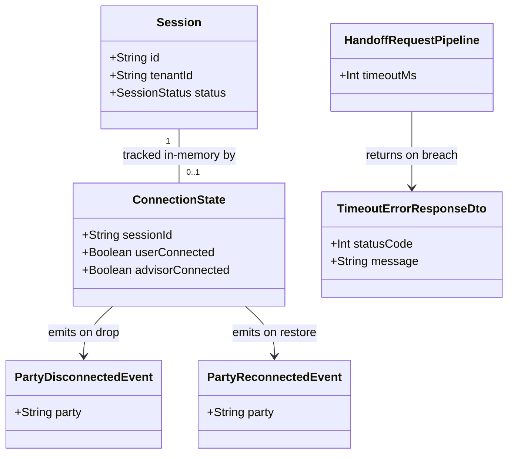

# Availability Fail-safe

## Requirements

Guarantee Crossfade can never degrade a tenant's own product's availability:
bound the handoff-intake endpoint's worst-case response time so a tenant request
never hangs, make a dropped real-time chat connection visible to the
still-connected party instead of silent apparent abandonment, and let both
surfaces recover automatically once Crossfade is healthy again — hardening 002's
and 003's existing behavior against Crossfade-side failure without changing what
either feature actually does.

## Entities

## Approach

1. Cross-Cutting Hardening, No New Module:
   - This feature introduces no new domain module and no new Prisma model — it
     is entirely a hardening layer over 002's
     `HandoffsController`/`HandoffsService` and 003's `ChatGateway`. Both
     changes are additive constraints on existing, already-specified behavior;
     neither changes what a successful request/connection does, only what
     happens under failure.
   - **Hard prerequisite**: this Operations section assumes 002
     (`HandoffsModule`, `HandoffsController`) and 003 (`ChatModule`,
     `ChatGateway`, `ConnectionState`-adjacent socket lifecycle) already exist
     in `apps/api`. If they do not, their own REASONS-Canvas Operations MUST be
     executed first. This feature has no dependency on 001's operator/tenant
     surface beyond what 002/003 already inherited, and no dependency on 004 at
     all (004 depends on 003's terminal transitions; this feature only touches
     003's _connection_ lifecycle, a disjoint concern).
   - One small, shared, reusable component is added rather than a one-off fix: a
     `common/timeout.interceptor.ts` NestJS interceptor, usable by any future
     synchronous tenant-facing endpoint that needs the same bounded-response
     guarantee, not hardcoded to `handoffs` alone.

2. Technical Implementation:
   - Bounded response time: a NestJS interceptor wraps the handoff-intake
     request pipeline with a hard **5-second** server-side timeout (concrete
     value, resolving the spec's "a few seconds" range to one documented number
     per FR-005). If the handler hasn't emitted a response within 5 seconds, the
     interceptor unsubscribes from the in-flight observable and the framework
     returns `503 Service Unavailable` — the client never waits past 5 seconds,
     regardless of what's happening downstream (e.g., a slow database).
   - **Known, explicitly accepted limitation**: unsubscribing from the request
     observable stops the _response_ from waiting further, but does not forcibly
     cancel an already-issued Prisma/Postgres query — the underlying database
     call may still complete in the background after the client has received its
     `503`. This is accepted for v1 (handoff-intake's actual work is a single
     fast insert-or-conflict, per 002 — a genuine 5-second stall indicates real
     infrastructure trouble, not routine variance) rather than solved with
     query-level cancellation infrastructure, but is documented here so it is a
     conscious trade-off, not a silent gap.
   - Real-time disconnect detection: uses Socket.IO's built-in ping/pong
     heartbeat (already active the moment 003's gateway exists, no new
     dependency) — but with its `pingInterval`/`pingTimeout` **explicitly tuned
     down** from their multi-tens-of-seconds defaults to values that guarantee
     detection within SC-002's "a few seconds" bound (`pingInterval: 2000ms`,
     `pingTimeout: 3000ms` — worst-case detection ≈5 seconds from an actual
     drop, consistent with and no slower than the handoff-intake bound above).
     This directly resolves the gap flagged in analysis: relying on the
     transport's _default_ heartbeat configuration would not have met SC-002 at
     all.
   - On detecting a drop (via `disconnect` event or heartbeat timeout) for one
     party in an active session's room, the gateway broadcasts
     `party:disconnected` to the _other_ party's socket if still connected; on
     that party rejoining the same room, broadcasts `party:reconnected`. Neither
     event touches `Session.status` — a disconnect is never a session-concluding
     transition (that remains 003's `end`/abandonment-sweep territory,
     unmodified).
   - No new `GlobalExceptionHandler` — the `503` from the timeout interceptor
     uses 001's existing `ErrorResponse` shape and flows through the existing
     `GlobalExceptionFilter` unchanged; disconnect/reconnect events use the
     gateway's own event-emission pattern (already established in 003 for
     `message:rejected`), not the HTTP exception path.

3. Business Logic:
   - The 5-second bound applies uniformly regardless of _why_ the handler is
     slow — there is no special-cased "this kind of slowness is exempt."
   - A response that would have eventually succeeded but exceeds the bound is
     treated identically to an outright failure from the caller's perspective:
     `503`, nothing else.
   - Connection-state tracking and disconnect notification live entirely
     in-process, in-memory, scoped per session's Socket.IO room — never
     persisted, never queried historically, rebuilt fresh from live socket
     connections on any process restart.
   - Recovery requires zero new logic: because no new stateful "Crossfade is
     down" flag is introduced anywhere by this feature, a request made after
     Crossfade becomes healthy is indistinguishable from any other request and
     simply succeeds — FR-004 is satisfied by _absence_ of state to reset, not
     by a reset mechanism.

## Structure

### Inheritance Relationships

1. `TimeoutInterceptor` implements Nest's `NestInterceptor` interface.
2. No new `BusinessException` subclass hierarchy — the `503` timeout response is
   constructed directly by the interceptor (via RxJS's `TimeoutError` mapped to
   an `HttpException` with status `503`), not routed through a domain-level
   `BusinessException`, since this is infrastructure-level behavior applicable
   to any endpoint the interceptor wraps, not a single feature's business rule.
3. `party:disconnected`/`party:reconnected` are plain event payloads emitted via
   the existing `ChatGateway`'s socket/room broadcast mechanism (003) — no new
   class hierarchy.

### Dependencies

1. `HandoffsController`'s `POST /handoffs` route (002, extended) is decorated
   with `@UseInterceptors(TimeoutInterceptor)` — the interceptor has no
   dependency on `HandoffsService` or any domain logic; it wraps the
   request/response observable generically.
2. `ChatGateway` (003, extended) gains a dependency on socket-level heartbeat
   configuration (set at gateway/adapter initialization, not per-connection) and
   an in-memory `Map<sessionId, ConnectionState>` held as a private field or
   small internal helper — no new injectable service is strictly required at
   this scale, though implementers MAY extract it into a small
   `ConnectionTrackingService` if `ChatGateway` is already large, per 003's own
   module conventions.
3. `TimeoutInterceptor` depends on nothing beyond NestJS/RxJS primitives
   (`timeout()` operator, `catchError`) — deliberately dependency-free so it's
   safely reusable by any future endpoint.
4. `GlobalExceptionFilter` (001, global) covers the `503` this feature's
   interceptor produces, same as every other HTTP error in the codebase.

### Layered Architecture

1. Interceptor Layer (new for this feature): `TimeoutInterceptor` — sits between
   the controller and the response, generic and reusable, the codebase's first
   interceptor-level (as opposed to guard/filter-level) cross-cutting component.
2. Controller Layer: `HandoffsController` (002, extended only by one decorator
   addition — no handler logic change).
3. Gateway Layer: `ChatGateway` (003, extended) — gains heartbeat configuration
   and disconnect/reconnect event emission alongside its existing
   `message:send`/`session:snapshot` responsibilities.
4. Exception Handling Layer: `GlobalExceptionFilter` (001, reused, unchanged) —
   covers the new `503`; disconnect/reconnect events bypass this layer entirely,
   consistent with 003's own `message:rejected` pattern for WS-transport-native
   signaling.

## Operations

### Implement Interceptor - `TimeoutInterceptor`

1. Responsibility: Enforce a hard, configurable, server-side response-time
   ceiling on any route it decorates — generic infrastructure, not
   handoff-intake-specific logic.
2. Attributes:
   - `timeoutMs`: `number` — constructor parameter, so the interceptor is
     reusable with different bounds if a future endpoint needs one;
     handoff-intake's own decoration passes `5000`.
3. Methods:
   - `intercept(context: ExecutionContext, next: CallHandler): Observable<unknown>`
     - Logic:
       - Wrap `next.handle()` with RxJS's `timeout(this.timeoutMs)`.
       - On timeout, `catchError` intercepts the resulting `TimeoutError` and
         throws a `ServiceUnavailableException` (Nest's built-in, maps to `503`)
         with message `"Handoff intake did not complete in time"` (matching
         `contracts/handoff-intake-timeout.md` exactly) — any other error passes
         through unmodified (the interceptor only adds timeout behavior, it does
         not swallow or reshape genuine handler errors like validation `400`s or
         duplicate-slug `409`s).
       - No explicit cancellation of downstream work is attempted (accepted
         limitation, per Approach) — the interceptor's only job is to stop the
         _response_ from waiting past the bound.
4. Annotations: applied per-route via
   `@UseInterceptors(new TimeoutInterceptor(5000))` (or a constant-backed
   factory, e.g.
   `HandoffTimeoutInterceptor = () => new TimeoutInterceptor(5000)`, to avoid a
   magic number at the call site) on `HandoffsController`'s `POST /handoffs`
   handler — NOT applied globally, since other endpoints (e.g., 001's tenant
   registration, 003's advisor session actions) have not been analyzed against
   this bound and should not silently inherit it without their own deliberate
   decision.
5. Constraints: `timeoutMs` MUST be a named constant (e.g.
   `HANDOFF_INTAKE_TIMEOUT_MS = 5000`) at the call site, not an inline literal,
   so the bound documented in `contracts/handoff-intake-timeout.md` and the
   bound actually enforced in code can never silently drift apart.

### Extend Controller - `HandoffsController` (002)

1. Responsibility: `POST /handoffs` gains the timeout guarantee; no change to
   its existing request validation, duplicate-handling, or response-shape logic
   (002, unmodified).
2. Methods:
   - Existing `createHandoff(...)` handler: unchanged body — only the
     class/method-level
     `@UseInterceptors(TimeoutInterceptor(HANDOFF_INTAKE_TIMEOUT_MS))`
     decoration is added.
3. Constraints: this is the ONLY change to
   `HandoffsController`/`HandoffsService` this feature makes — no modification
   to 002's DTO validation, uniqueness-conflict handling, or response DTOs, per
   the isolation discipline flagged as a risk in analysis (this feature must not
   creep into altering 002's actual business logic).

### Extend Gateway - `ChatGateway` (003)

1. Responsibility: gains heartbeat tuning and disconnect/reconnect
   detection-and-broadcast; no change to
   `message:send`/`session:snapshot`/`session:ended` handling (003, unmodified).
2. Configuration:
   - At `@WebSocketGateway()` initialization, set `pingInterval: 2000` and
     `pingTimeout: 3000` (milliseconds) — overriding Socket.IO's defaults so a
     silent connection drop is detected within a bounded, few-second window
     (worst case ≈5s: one missed ping interval plus the timeout), satisfying
     SC-002.
3. Methods:
   - `handleConnection(client: Socket)` (003, extended): after the existing
     auth/room-join logic succeeds (unchanged), additionally: mark this party
     (`user` or `advisor`, already known from which credential authenticated the
     connection, per 003) as connected in the in-memory `ConnectionState` map
     for this `sessionId`; if the _other_ party is currently marked connected,
     emit `party:reconnected` (`{ party: thisPartyType }`) to that other party's
     socket — covers the case where this connection is itself a reconnect after
     a prior drop.
   - `handleDisconnect(client: Socket)` (003, extended): existing behavior (room
     leave) unchanged, plus: mark this party as disconnected in
     `ConnectionState` for this session; if the _other_ party is currently
     connected, emit `party:disconnected` (`{ party: thisPartyType }`) to that
     other party's socket.
   - Socket.IO's own heartbeat timeout triggers the same `handleDisconnect`
     lifecycle hook as a clean close (this is existing Socket.IO/NestJS gateway
     behavior, not new code to write) — so the single `handleDisconnect`
     extension above covers both the clean-disconnect and
     silent-heartbeat-timeout cases without a separate code path.
4. Constraints: `ConnectionState` is per-process, in-memory only (a
   `Map<sessionId, { userConnected: boolean; advisorConnected: boolean }>`); it
   is never persisted, never queried by any REST endpoint, and is correctly
   reset (implicitly, by process restart) — this feature does not add any Prisma
   model or migration.

### Create DTO - `TimeoutErrorResponseDto`

1. Responsibility: Document/type the `503` response shape produced by
   `TimeoutInterceptor` for handoff-intake, matching
   `contracts/handoff-intake-timeout.md`.
2. Attributes:
   `{ statusCode: 503, message: "Handoff intake did not complete in time" }` —
   identical shape to every other `ErrorResponse` in the codebase (001's
   convention), no new error-format introduced.
3. Constraints: this DTO exists for documentation/OpenAPI clarity only — the
   actual response is produced by `ServiceUnavailableException` inside
   `TimeoutInterceptor`, flowing through the existing `GlobalExceptionFilter`.

## Norms

1. Annotation Standards: `TimeoutInterceptor` uses `@UseInterceptors()`, the
   first use of Nest's interceptor decorator family in this codebase (001–004
   used guards and filters, not interceptors) — applied narrowly, per-route,
   never globally without a deliberate per-endpoint decision.
2. Dependency Injection: `TimeoutInterceptor` takes its timeout value via
   constructor argument (not DI-injected configuration) since it's instantiated
   per-decoration with an explicit, named-constant value — keeps the bound
   visible at the call site rather than hidden in a config service.
3. Exception Handling: the `503` from `TimeoutInterceptor` reuses 001's
   `ErrorResponse`/`GlobalExceptionFilter` unchanged — no new exception class
   hierarchy for this feature's REST-side behavior;
   `party:disconnected`/`party:reconnected` are WS-native events, not
   exceptions, following the same non-exception-based error-signaling pattern
   003 already established for `message:rejected`.
4. Data Validation: no new validation rules — this feature adds no new request
   fields to any DTO; `EndSessionDto`/`CreateHandoffRequestDto`/etc. (from prior
   features) are untouched.
5. Logging: log timeout occurrences on the handoff-intake path
   (`sessionId`-adjacent request identifiers, not full request bodies) at a
   level that makes sustained `503`s operationally visible (they indicate real
   infrastructure degradation, not routine behavior); log disconnect/reconnect
   events at debug/info level with `sessionId` and `party`, never full message
   content (unrelated to this feature, but worth restating the existing
   discipline since this feature touches the same gateway).
6. Documentation Standards: `contracts/handoff-intake-timeout.md` and
   `contracts/chat-disconnect-events.md` remain the binding source of truth for
   the exact bound value, response shape, and event payloads — this Operations
   section must not diverge from either.

## Safeguards

1. Functional Constraints: `POST /handoffs` MUST return within 5 seconds under
   all conditions — success, business-rule failure (`400`/`409`), or timeout
   (`503`) — no code path may bypass the interceptor for this route; a
   disconnect MUST NEVER, by itself, transition `Session.status` — only 003's
   existing explicit-end or abandonment-sweep logic (unmodified by this feature)
   may do that.
2. Performance Constraints: the healthy-path latency of `POST /handoffs` MUST
   NOT measurably increase due to the interceptor's presence (SC-001's bound is
   a ceiling, not a floor — the interceptor adds negligible overhead on a
   request that completes well under 5 seconds); heartbeat-based disconnect
   detection MUST surface `party:disconnected` to the other party within 5
   seconds of an actual drop (SC-002), verified against the tuned
   `pingInterval`/`pingTimeout` values, not the transport's untouched defaults.
3. Security Constraints: no new attack surface — the interceptor and heartbeat
   tuning affect only timing/liveness behavior, not authentication or
   authorization; `TimeoutInterceptor` MUST NOT alter or suppress any existing
   auth-guard rejection (`401`/`403` from `TenantAuthGuard`/`AdvisorAuthGuard`)
   — those still fire before the interceptor's timeout window would ever matter,
   since guard rejection is near-instantaneous.
4. Integration Constraints: this feature MUST NOT modify 002's
   `HandoffsService`, its DTOs, its uniqueness-conflict handling, or its
   response shapes beyond the one interceptor decoration on the controller; MUST
   NOT modify 003's `message:send`/`session:snapshot`/`session:ended`/pickup/end
   logic, `Session` schema, or any Prisma model — its only footprint in 003 is
   the two `handleConnection`/`handleDisconnect` additions and gateway-level
   heartbeat configuration, both additive.
5. Business Rule Constraints: the 5-second handoff-intake bound and the
   ~5-second disconnect-detection bound MUST both be named constants documented
   in their respective contract files, never magic numbers scattered across the
   codebase; recovery (FR-004) MUST remain achievable with zero new persisted or
   long-lived in-memory "outage" state — any future change that introduces a
   circuit-breaker-style flag requiring manual or conditional reset would
   violate this feature's core guarantee and MUST be treated as a regression,
   not an enhancement.
6. Exception Handling Constraints:
   - The `503` timeout response MUST use the exact message from
     `contracts/handoff-intake-timeout.md` and MUST flow through the existing
     `GlobalExceptionFilter` — no separate error-formatting path.
   - `TimeoutInterceptor` MUST NOT swallow or reshape any non-timeout error from
     the wrapped handler (validation failures, duplicate-slug conflicts, etc.
     must reach the client exactly as 002 already specifies them).
   - Disconnect/reconnect events MUST NEVER be thrown as exceptions or routed
     through `GlobalExceptionFilter` — they are WS-transport-native broadcasts
     only.
7. Technical Constraints: `pingInterval`/`pingTimeout` values MUST be set
   explicitly at gateway configuration (not left at Socket.IO defaults) — this
   is a hard requirement, not a tuning suggestion, since the analysis-flagged
   gap (defaults are tens of seconds, not "a few") would otherwise silently fail
   SC-002; the `TimeoutInterceptor`'s lack of downstream-query cancellation is
   an accepted v1 limitation and MUST be revisited only if handoff-intake's
   actual execution profile changes (e.g., gains a slow external call) — not
   preemptively engineered around now.
8. Data Constraints: `ConnectionState` MUST remain purely in-memory — no Prisma
   model, no migration, no persisted table for this feature; it MUST be scoped
   per `sessionId` and MUST NOT leak connection state across different sessions'
   rooms.
9. API Constraints: the `503` response shape MUST exactly match
   `contracts/handoff-intake-timeout.md`; the
   `party:disconnected`/`party:reconnected` event names and payload shape
   (`{ party: "advisor" | "user" }`) MUST exactly match
   `contracts/chat-disconnect-events.md` — both contracts are binding, not
   illustrative, consistent with how every prior feature's contracts were
   treated.
